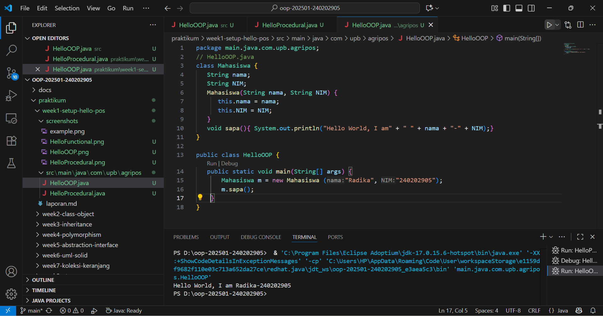

# Laporan Praktikum Minggu 1
Topik: ["Paradigma dan Setup"]

## Identitas
- Nama  : Radika Rismawati Tri Prasaja
- NIM   : 240202905
- Kelas : 3IKRB

---

## Tujuan
1. Mahasiswa mampu mendefinisikan paradigma prosedural, OOP, dan fungsional.
2. Mahasiswa mampu membandingkan kelebihan dan keterbatasan tiap paradigma.
3. Mahasiswa mampu memberikan contoh program sederhana untuk masing-masing paradigma.
4. Mahasiswa aktif dalam diskusi kelas (bertanya, menjawab, memberi opini).

---

## Dasar Teori
Paradigma pemrograman adalah cara pandang dalam menyusun program:

1. Prosedural: program dibangun sebagai rangkaian perintah (fungsi/prosedur).
2. OOP (Object-Oriented Programming): program dibangun dari objek yang memiliki data (atribut) dan perilaku (method).
3. Fungsional: program dipandang sebagai pemetaan fungsi matematika, lebih menekankan ekspresi dan transformasi data.

Dalam konteks Agri-POS, OOP membantu memodelkan entitas nyata seperti Produk, Transaksi, dan Pembayaran sebagai objek. Dengan demikian, sistem lebih mudah dikembangkan dan dipelihara.
---

## Langkah Praktikum
1. Setup Project

   a. Pastikan sudah menginstall JDK (Java Development Kit), IDE (misal: IntelliJ IDEA, VS Code,   NetBeans), Git, PostgreSQL, dan JavaFX di komputer.
   b. Buat folder project oop-pos-<nim>.
   c. Inisialisasi repositori Git.
   d. Buat struktur awal src/main/java/com/upb/agripos/.
   e. Pastikan semua tools dapat berjalan (uji dengan membuat dan menjalankan program Java sederhana).
2. Program Sederhana dalam 3 Paradigma

   a. Prosedural: program untuk menghitung total harga dua produk.
   b. OOP: class Produk dengan atribut nama dan harga, buat minimal tiga objek, lalu hitung total.
   c. Fungsional: gunakan Stream atau lambda untuk menghitung total harga dari minimal tiga objek.

3. Commit dan Push

   a. Commit dengan pesan: week1-setup-hello-pos.
---

## Kode Program

1. Procedural 
```

// HelloProcedural.java
public class HelloProcedural {
    public static void main(String[] args) {
        String nim = "240202905";
        String nama = "Radika";

        System.out.println("Hello World, I am" + " " + nama + "-" + nim);
    }
}
```

2. OOP
```
// HelloOOP.java
class Mahasiswa {
   String nama;
   String NIM;
   Mahasiswa(String nama, String NIM) {
      this.nama = nama;
      this.NIM = NIM;
   }
   void sapa(){ System.out.println("Hello World, I am" + " " + nama + "-" + NIM);}
}

public class HelloOOP {
   public static void main(String[] args) {
       Mahasiswa m = new Mahasiswa ("Radika", "240202905");
       m.sapa();
    }
}
```

3. Functional
```
// HelloFunctional.java
import java.util.function.BiConsumer;
public class HelloFunctional {
    public static void main(String[] args) {
        BiConsumer<String,String> sapa =
        (nama, NIM) -> System.out.println("Hello World, I am" + " " + nama + "-" + NIM);
        sapa.accept("Radika", "240202905");
    }
}

```
---

## Hasil Eksekusi
<<<<<<< HEAD
Sertakan screenshot hasil eksekusi program.  
1. 
2. 
3. 

=======
>>>>>>> c22f7a1807668eaec1c6ad8706dc7c17feb2a4c5

---

## Analisis
- Jelaskan bagaimana kode berjalan.  
1. Procedural
   HelloProcedural.java

Program ini menggunakan pendekatan prosedural, yaitu semua perintah dijalankan secara berurutan dalam satu fungsi utama main(). Di dalamnya terdapat dua variabel, nama dan nim, yang menyimpan nilai "Radika" dan "240202905". Keduanya digabung menggunakan System.out.println("Hello World, I am " + nama + "-" + nim); untuk menampilkan hasil di layar. Semua logika berada di satu tempat tanpa class atau objek tambahan. Pendekatan ini mudah dipahami untuk program kecil namun kurang efisien untuk sistem besar karena tidak terstruktur.

Output:

Hello World, I am Radika-240202905

2. OOP
   HelloOOP.java

Program ini memakai pendekatan Object-Oriented Programming (OOP) yang membagi kode menjadi class dan objek. Terdapat class Mahasiswa yang memiliki atribut nama dan NIM, serta konstruktor untuk menginisialisasinya. Di dalamnya juga ada method sapa() untuk mencetak pesan sapaan. Pada class utama HelloOOP, objek baru dibuat dari class Mahasiswa dengan new Mahasiswa("Radika", "240202905"), lalu method sapa() dipanggil untuk menampilkan hasil.

Pendekatan ini lebih terorganisir karena data dan perilaku disatukan dalam objek. OOP memudahkan pengembangan program besar karena strukturnya modular dan dapat digunakan kembali.

Output:

Hello World, I am Radika-240202905

3. Functional
   HelloFunctional.java

Program ini menggunakan pendekatan functional programming yang berfokus pada fungsi dan ekspresi. Program memakai interface bawaan Java, yaitu BiConsumer, yang menerima dua parameter. Fungsi sapa didefinisikan menggunakan lambda expression (nama, NIM) -> System.out.println("Hello World, I am " + nama + "-" + NIM);, kemudian dijalankan dengan sapa.accept("Radika", "240202905");.

Pendekatan ini lebih ringkas karena tidak perlu membuat class atau objek baru. Semua logika langsung ditulis dalam bentuk fungsi yang dapat dijalankan secara cepat dan sederhana.

Output:

Hello World, I am Radika-240202905

- Kendala yang dihadapi dan cara mengatasinya.  
Beberapa kendala yang mungkin muncul antara lain error “package does not exist” karena struktur folder tidak sesuai dengan deklarasi package. Solusinya adalah memastikan struktur folder sama seperti yang dideklarasikan, misalnya main/java/com/upb/agripos. Kendala lain adalah error “BiConsumer cannot be resolved” yang disebabkan belum menambahkan import java.util.function.BiConsumer;, sehingga perlu menambahkan baris import tersebut di awal file. Selain itu, error NoClassDefFoundError dapat muncul jika nama file dan nama class tidak sama, sehingga harus disesuaikan.

Jika program tidak berjalan di VS Code, biasanya karena konfigurasi Java runtime belum aktif. Solusinya adalah menjalankan program dengan tombol Run Java di kanan atas atau memilih menu Run > Start Debugging. Pastikan juga output dijalankan di terminal Java bawaan agar hasilnya muncul dengan benar.
---

## Kesimpulan
Dapat disimpulkan bahwa ketiganya menghasilkan output yang sama, namun memiliki cara kerja dan struktur berbeda. Pendekatan Procedural menulis semua langkah secara berurutan dalam satu fungsi utama, sehingga mudah dipahami namun kurang fleksibel untuk program besar. Pendekatan OOP membagi program ke dalam objek yang memiliki atribut dan perilaku, membuat kode lebih terstruktur, rapi, dan mudah dikembangkan. Sedangkan Functional menggunakan ekspresi lambda yang lebih ringkas dan efisien tanpa harus membuat class atau objek tambahan.

Secara keseluruhan, setiap paradigma memiliki keunggulan masing-masing: prosedural cocok untuk program sederhana, OOP untuk sistem besar dan kompleks, dan fungsional untuk penulisan kode yang singkat dan efisien.
---

## Quiz
1. Apakah OOP selalu lebih baik dari prosedural? 
**Jawaban:** Tidak selalu. OOP memang lebih baik untuk proyek besar dan kompleks karena memiliki struktur yang rapi dan mendukung modularitas, tetapi untuk program sederhana atau tugas kecil, pendekatan prosedural bisa lebih efisien dan mudah diterapkan. Jadi, pemilihan paradigma tergantung pada skala dan kebutuhan program yang dibuat.

2. Kapan functional programming lebih cocok digunakan dibanding OOP atau prosedural? 
**Jawaban:** Functional programming lebih cocok digunakan ketika program berfokus pada pemrosesan data, transformasi nilai, atau operasi matematis yang berulang. Paradigma ini juga ideal saat ingin menulis kode yang singkat, bebas efek samping, dan mudah diuji, seperti dalam pemrosesan data besar, pemrograman paralel, atau logika bisnis yang sederhana namun sering diulang.

3. Bagaimana paradigma (prosedural, OOP, fungsional) memengaruhi maintainability dan scalability aplikasi? 
**Jawaban:** Paradigma sangat memengaruhi kemudahan pemeliharaan dan pengembangan aplikasi. Prosedural cenderung sulit dikelola saat program semakin besar karena semua logika terpusat di satu tempat. OOP lebih mudah di-maintain karena kode dibagi ke dalam objek yang terpisah dan saling berinteraksi. Sementara fungsional mendukung skalabilitas dengan menulis fungsi-fungsi kecil yang independen, sehingga mudah diubah dan digunakan kembali tanpa memengaruhi bagian lain dari program.

4. Mengapa OOP lebih cocok untuk mengembangkan aplikasi POS dibanding prosedural? 
**Jawaban:** Karena aplikasi POS memiliki banyak entitas seperti produk, pelanggan, transaksi, dan pembayaran yang saling berhubungan. Dengan OOP, setiap entitas dapat dimodelkan sebagai objek dengan atribut dan perilakunya sendiri. Hal ini membuat program lebih mudah dikembangkan, diuji, serta diperluas tanpa harus mengubah keseluruhan kode.

5. Bagaimana paradigma fungsional dapat membantu mengurangi kode berulang (boilerplate code)? **Jawaban:** Paradigma fungsional memungkinkan penggunaan fungsi-fungsi murni, lambda expression, dan higher-order functions yang dapat digunakan kembali di berbagai bagian program. Dengan cara ini, programmer tidak perlu menulis ulang kode serupa berkali-kali, karena logika dapat disimpan dalam satu fungsi dan dipanggil sesuai kebutuhan, sehingga kode menjadi lebih ringkas, efisien, dan mudah dibaca.
