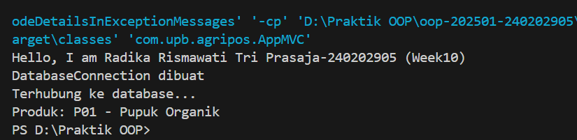
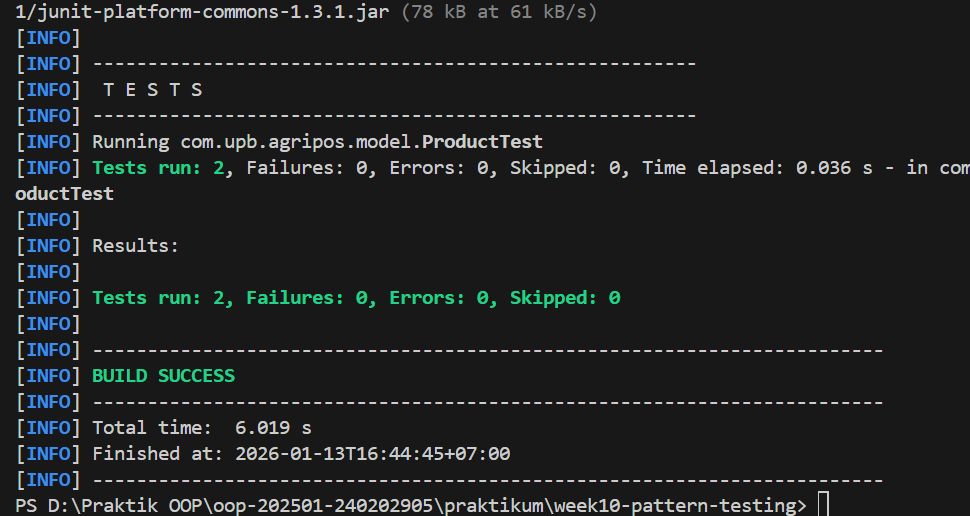

# Laporan Praktikum Minggu 10
Topik: Design Pattern (Singleton, MVC) dan Unit Testing menggunakan JUnit

## Identitas
- Nama  : Radika Rismawati Tri Prasaja
- NIM   : 240202905
- Kelas : 3IKRB

---

## Tujuan
1. Menjelaskan konsep dasar design pattern dalam rekayasa perangkat lunak.
2. Mengimplementasikan Singleton Pattern dengan benar.
3. Menjelaskan dan menerapkan Model–View–Controller (MVC) pada aplikasi sederhana.
4. Membuat dan menjalankan unit test menggunakan JUnit.
5. Menganalisis manfaat penerapan design pattern dan unit testing terhadap kualitas perangkat lunak.


---

## Dasar Teori
1. Design Pattern
Design pattern adalah solusi desain yang telah teruji untuk menyelesaikan masalah umum dalam pengembangan perangkat lunak. Fokus minggu ini:

**Singleton Pattern
**MVC (Model–View–Controller)

2. Singleton Pattern
Tujuan: Menjamin suatu class hanya memiliki satu instance dan menyediakan titik akses global.

Karakteristik:

- Constructor private
- Atribut static instance
- Method static getInstance()

Contoh Implementasi:
```
package com.upb.agripos.config;

public class DatabaseConnection {
    private static DatabaseConnection instance;
    private DatabaseConnection() {}

    public static DatabaseConnection getInstance() {
        if (instance == null) {
            instance = new DatabaseConnection();
        }
        return instance;
    }
}
```
Penerapan pada Agri-POS: koneksi database atau service global yang tidak boleh lebih dari satu instance.

3. MVC (Model–View–Controller)
Memisahkan tanggung jawab aplikasi:

| Komponen   | Tanggung Jawab              |
|------------|-----------------------------|
| Model      | Data dan logika bisnis      |
| View       | Tampilan / Output           |
| Controller | Penghubung Model dan View   |

Contoh Struktur MVC Sederhana:

- Model → Product
- View → ConsoleView
- Controller → ProductController

---

## Langkah Praktikum
1. Implementasikan Singleton untuk DatabaseConnection.
2. Buat struktur MVC sederhana untuk fitur Product.
3. Buat minimal 1 unit test JUnit.
4. Jalankan unit test dan dokumentasikan hasilnya.
Commit message:

week10-pattern-testing: [fitur] [deskripsi singkat]

**Implementasi Praktikum**

1. Model
```
package com.upb.agripos.model;

public class Product {
    private final String code;
    private final String name;

    public Product(String code, String name) {
        this.code = code;
        this.name = name;
    }

    public String getCode() { return code; }
    public String getName() { return name; }
}
```
2. View
```
package com.upb.agripos.view;

public class ConsoleView {
    public void showMessage(String message) {
        System.out.println(message);
    }
}
```
3. Controller (WAJIB DIISI)
```
package com.upb.agripos.controller;

import com.upb.agripos.model.Product;
import com.upb.agripos.view.ConsoleView;

public class ProductController {
    private final Product model;
    private final ConsoleView view;

    public ProductController(Product model, ConsoleView view) {
        this.model = model;
        this.view = view;
    }

    public void showProduct() {
        view.showMessage("Produk: " + model.getCode() + " - " + model.getName());
    }
}
```
4. Main Program (Integrasi MVC)
```
package com.upb.agripos;

import com.upb.agripos.model.Product;
import com.upb.agripos.view.ConsoleView;
import com.upb.agripos.controller.ProductController;

public class AppMVC {
    public static void main(String[] args) {
        System.out.println("Hello, I am [Nama]-[NIM] (Week10)");
        Product product = new Product("P01", "Pupuk Organik");
        ConsoleView view = new ConsoleView();
        ProductController controller = new ProductController(product, view);
        controller.showProduct();
    }
}
```
**Unit Testing Menggunakan JUnit**

Tujuan unit testing:

- Memastikan fungsi berjalan sesuai harapan
- Mendeteksi kesalahan lebih awal
- Meningkatkan kepercayaan terhadap kode
Contoh Unit Test JUnit
```
package com.upb.agripos;

import static org.junit.jupiter.api.Assertions.*;
import org.junit.jupiter.api.Test;
import com.upb.agripos.model.Product;

public class ProductTest {
    @Test
    public void testProductName() {
        Product p = new Product("P01", "Benih Jagung");
        assertEquals("Benih Jagung", p.getName());
    }
}
```

Kriteria unit test benar:

- Menggunakan anotasi @Test
- Menggunakan assertion
- Test dapat dijalankan tanpa error
---

## Kode Program
1. DatabaseConnection.java
```
package com.upb.agripos.config;

public class DatabaseConnection {

    private static DatabaseConnection instance;

    // constructor private → wajib untuk Singleton
    private DatabaseConnection() {
        System.out.println("DatabaseConnection dibuat");
    }

    // global access point
    public static DatabaseConnection getInstance() {
        if (instance == null) {
            instance = new DatabaseConnection();
        }
        return instance;
    }

    public void connect() {
        System.out.println("Terhubung ke database...");
    }
}
```
2. ProductController.java
```
package com.upb.agripos.controller;

import com.upb.agripos.model.Product;
import com.upb.agripos.view.ConsoleView;

public class ProductController {
    private final Product model;
    private final ConsoleView view;

    public ProductController(Product model, ConsoleView view) {
        this.model = model;
        this.view = view;
    }

    public void showProduct() {
        view.showMessage("Produk: " + model.getCode() + " - " + model.getName());
    }
}
```
3. Product.java
```
package com.upb.agripos.model;

public class Product {
    private String code;
    private String name;

    public Product(String code, String name) {
        this.code = code;
        this.name = name;
    }

    public String getCode() {
        return code;
    }

    public void setCode(String code) {
        this.code = code;
    }

    public String getName() {
        return name;
    }

    public void setName(String name) {
        this.name = name;
    }
}
```
4. ConsoleView.java
```
package com.upb.agripos.view;

public class ConsoleView {
    public void showMessage(String message) {
        System.out.println(message);
    }
}
```
5. AppMVC.java
```
package com.upb.agripos;

import com.upb.agripos.config.DatabaseConnection;
import com.upb.agripos.controller.ProductController;
import com.upb.agripos.model.Product;
import com.upb.agripos.view.ConsoleView;

public class AppMVC {
    public static void main(String[] args) {

        System.out.println("Hello, I am Radika Rismawati Tri Prasaja-240202905 (Week10)");

        // Singleton test
        DatabaseConnection db1 = DatabaseConnection.getInstance();
        db1.connect();

        // MVC
        Product product = new Product("P01", "Pupuk Organik");
        ConsoleView view = new ConsoleView();
        ProductController controller = new ProductController(product, view);

        controller.showProduct();
    }
}
```
6. ProductTest.java
```
package com.upb.agripos.model;

import static org.junit.jupiter.api.Assertions.assertEquals;
import org.junit.jupiter.api.Test;

public class ProductTest {

    @Test
    public void testProductName() {
        Product product = new Product("P01", "Benih Jagung");
        assertEquals("Benih Jagung", product.getName());
    }

    @Test
    public void testProductCode() {
        Product product = new Product("P02", "Pupuk Cair");
        assertEquals("P02", product.getCode());
    }
}
```
7. pom.xml
<?xml version="1.0" encoding="UTF-8"?>
<project xmlns="http://maven.apache.org/POM/4.0.0"
         xmlns:xsi="http://www.w3.org/2001/XMLSchema-instance"
         xsi:schemaLocation="http://maven.apache.org/POM/4.0.0
         http://maven.apache.org/xsd/maven-4.0.0.xsd">
    <modelVersion>4.0.0</modelVersion>

    <groupId>com.upb</groupId>
    <artifactId>agripos</artifactId>
    <version>1.0-SNAPSHOT</version>

    <properties>
        <maven.compiler.source>17</maven.compiler.source>
        <maven.compiler.target>17</maven.compiler.target>
        <project.build.sourceEncoding>UTF-8</project.build.sourceEncoding>
    </properties>

    <dependencyManagement>
        <dependencies>
            <dependency>
                <groupId>org.junit</groupId>
                <artifactId>junit-bom</artifactId>
                <version>5.11.0</version>
                <type>pom</type>
                <scope>import</scope>
            </dependency>
        </dependencies>
    </dependencyManagement>

    <dependencies>
        <!-- JUnit 5 API -->
        <dependency>
            <groupId>org.junit.jupiter</groupId>
            <artifactId>junit-jupiter-api</artifactId>
            <scope>test</scope>
        </dependency>
        <!-- JUnit 5 Engine -->
        <dependency>
            <groupId>org.junit.jupiter</groupId>
            <artifactId>junit-jupiter-engine</artifactId>
            <scope>test</scope>
        </dependency>
    </dependencies>

    <build>
        <sourceDirectory>src/main/java</sourceDirectory>
        <testSourceDirectory>src/test/java</testSourceDirectory>
        <plugins>
            <plugin>
                <groupId>org.apache.maven.plugins</groupId>
                <artifactId>maven-compiler-plugin</artifactId>
                <version>3.8.1</version>
                <configuration>
                    <source>11</source>
                    <target>11</target>
                </configuration>
            </plugin>
            <plugin>
                <groupId>org.apache.maven.plugins</groupId>
                <artifactId>maven-surefire-plugin</artifactId>
                <version>2.22.2</version>
            </plugin>
        </plugins>
    </build>
</project>

---

## Hasil Eksekusi
1. 
2. 
---

## Analisis

1. Jelaskan bagaimana kode berjalan!
Jawab: Program diawali dengan eksekusi class AppMVC sebagai main program.
Pertama, sistem menampilkan identitas mahasiswa pada console.
Selanjutnya, Singleton Pattern dijalankan melalui pemanggilan DatabaseConnection.getInstance(). Karena constructor bersifat private, objek DatabaseConnection hanya dibuat satu kali dan digunakan secara global untuk simulasi koneksi database.

Setelah itu, konsep MVC (Model–View–Controller) dijalankan:

- Model (Product) menyimpan data produk berupa kode dan nama.
- View (ConsoleView) bertugas menampilkan informasi ke layar.
- Controller (ProductController) menghubungkan model dan view, serta mengatur alur logika untuk menampilkan data produk.

Terakhir, unit testing menggunakan JUnit dijalankan untuk memastikan bahwa method getName() dan getCode() pada class Product bekerja sesuai harapan tanpa error.

2. Apa perbedaan pendekatan minggu ini dibanding minggu sebelumnya?
Jawab: Pada minggu 9, fokus pembelajaran lebih pada error handling dan exception, termasuk penggunaan try-catch-finally dan custom exception untuk menangani kesalahan saat runtime.

Sedangkan pada minggu 10, pendekatan bergeser ke arsitektur dan kualitas perangkat lunak, yaitu:

- Penggunaan design pattern (Singleton dan MVC) untuk struktur kode yang lebih rapi dan terorganisir.
- Penerapan unit testing (JUnit) untuk memastikan setiap bagian kode berjalan dengan benar sejak awal.

Dengan demikian, minggu 10 lebih menekankan pada maintainability, scalability, dan reliability aplikasi.

3. Kendala yang dihadapi dan cara mengatasinya
Jawab: Kendala yang dihadapi antara lain:

- Kesalahan pemanggilan method atau struktur package yang menyebabkan error kompilasi.
- Unit test tidak berjalan karena konfigurasi Maven atau dependency JUnit belum lengkap.
- Kebingungan dalam memisahkan peran Model, View, dan Controller.

Cara mengatasinya:

- Memastikan setiap class berada pada package yang benar.
- Mengecek kembali dependency JUnit dan konfigurasi pom.xml.
- Memahami tanggung jawab masing-masing komponen MVC agar tidak terjadi duplikasi logika.

---

## Kesimpulan
Berdasarkan praktikum minggu ke-10, dapat disimpulkan bahwa penerapan design pattern dan unit testing sangat penting dalam pengembangan perangkat lunak.
Singleton Pattern membantu mengontrol pembuatan objek agar lebih efisien, sedangkan MVC memisahkan tanggung jawab aplikasi sehingga kode menjadi lebih terstruktur dan mudah dipelihara.
Selain itu, unit testing menggunakan JUnit berperan besar dalam mendeteksi kesalahan sejak dini dan meningkatkan kepercayaan terhadap kualitas kode.
Dengan menerapkan konsep-konsep ini, pengembangan aplikasi menjadi lebih profesional, terukur, dan siap untuk dikembangkan lebih lanjut.

---

## Quiz
1. Mengapa constructor pada Singleton harus bersifat private?
   **Jawaban:** Agar object dari class Singleton tidak dapat dibuat secara langsung menggunakan keyword new dari luar class, sehingga hanya ada satu instance yang dikontrol melalui method getInstance().

2. Jelaskan manfaat pemisahan Model, View, dan Controller!
   **Jawaban:** Pemisahan MVC membuat kode lebih terstruktur, mudah dipelihara, mudah dikembangkan, serta memisahkan logika bisnis, tampilan, dan pengendali aplikasi agar tidak saling bercampur.

3. Apa peran unit testing dalam menjaga kualitas perangkat lunak?
   **Jawaban:** Unit testing memastikan setiap fungsi berjalan sesuai harapan, membantu mendeteksi bug lebih awal, mengurangi risiko error saat pengembangan lanjutan, serta meningkatkan keandalan aplikasi.

4. Apa risiko jika Singleton tidak diimplementasikan dengan benar?
    **Jawaban:** Risikonya antara lain terbentuk lebih dari satu instance, penggunaan memori yang tidak efisien, konflik data, serta inkonsistensi akses terhadap resource global seperti database atau konfigurasi sistem.
