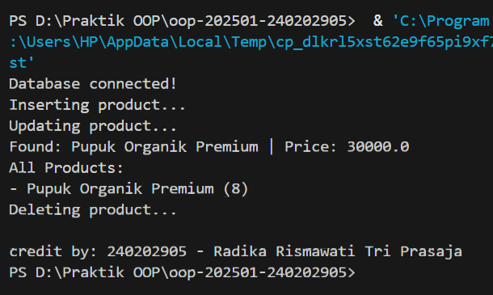

# Laporan Praktikum Minggu 11
Topik: Data Access Object (DAO) dan CRUD Database dengan JDBC

## Identitas
- Nama  : Radika Rismawati Tri Prasaja
- NIM   : 240202905
- Kelas : 3IKRB

---

## Tujuan
1. Menjelaskan konsep Data Access Object (DAO) dalam pengembangan aplikasi OOP.
2. Menghubungkan aplikasi Java dengan basis data menggunakan JDBC.
3. Mengimplementasikan operasi CRUD (Create, Read, Update, Delete) secara lengkap.
4. Mengintegrasikan DAO dengan class aplikasi OOP sesuai prinsip desain yang baik.

---

## Dasar Teori
1. Konsep Data Access Object (DAO)
DAO adalah pola desain yang memisahkan logika akses data dari logika bisnis aplikasi. Dengan DAO, perubahan teknologi basis data tidak memengaruhi logika utama aplikasi.

Manfaat DAO:

- Kode lebih terstruktur dan mudah dipelihara
- Mengurangi tight coupling antara aplikasi dan database
- Mendukung pengujian dan pengembangan lanjutan

2. JDBC dan Koneksi Database
JDBC (Java Database Connectivity) digunakan untuk menghubungkan aplikasi Java dengan basis data relasional, dalam praktikum ini menggunakan PostgreSQL.

Komponen utama JDBC:

- DriverManager
- Connection
- PreparedStatement
- ResultSet

---

## Langkah Praktikum
**Spesifikasi Teknis Praktikum**

1. Basis Data
Gunakan PostgreSQL dengan ketentuan minimal berikut:

Nama database: agripos

Struktur tabel produk:
```
CREATE TABLE products (
    code VARCHAR(10) PRIMARY KEY,
    name VARCHAR(100),
    price DOUBLE PRECISION,
    stock INT
);
```
2. Class Model – Product
```
package com.upb.agripos.model;

public class Product {
    private String code;
    private String name;
    private double price;
    private int stock;

    public Product(String code, String name, double price, int stock) {
        this.code = code;
        this.name = name;
        this.price = price;
        this.stock = stock;
    }

    public String getCode() { return code; }
    public String getName() { return name; }
    public double getPrice() { return price; }
    public int getStock() { return stock; }

    public void setName(String name) { this.name = name; }
    public void setPrice(double price) { this.price = price; }
    public void setStock(int stock) { this.stock = stock; }
}
```
3. Interface DAO
```
package com.upb.agripos.dao;

import java.util.List;
import com.upb.agripos.model.Product;

public interface ProductDAO {
    void insert(Product product) throws Exception;
    Product findByCode(String code) throws Exception;
    List<Product> findAll() throws Exception;
    void update(Product product) throws Exception;
    void delete(String code) throws Exception;
}
```
4. Implementasi DAO dengan JDBC
Implementasi DAO harus menggunakan PreparedStatement.
```
package com.upb.agripos.dao;

import java.sql.*;
import java.util.ArrayList;
import java.util.List;
import com.upb.agripos.model.Product;

public class ProductDAOImpl implements ProductDAO {

    private final Connection connection;

    public ProductDAOImpl(Connection connection) {
        this.connection = connection;
    }

    @Override
    public void insert(Product p) throws Exception {
        String sql = "INSERT INTO products(code, name, price, stock) VALUES (?, ?, ?, ?)";
        try (PreparedStatement ps = connection.prepareStatement(sql)) {
            ps.setString(1, p.getCode());
            ps.setString(2, p.getName());
            ps.setDouble(3, p.getPrice());
            ps.setInt(4, p.getStock());
            ps.executeUpdate();
        }
    }

    @Override
    public Product findByCode(String code) throws Exception {
        String sql = "SELECT * FROM products WHERE code = ?";
        try (PreparedStatement ps = connection.prepareStatement(sql)) {
            ps.setString(1, code);
            try (ResultSet rs = ps.executeQuery()) {
                if (rs.next()) {
                    return new Product(
                        rs.getString("code"),
                        rs.getString("name"),
                        rs.getDouble("price"),
                        rs.getInt("stock")
                    );
                }
            }
        }
        return null;
    }

    @Override
    public List<Product> findAll() throws Exception {
        List<Product> list = new ArrayList<>();
        String sql = "SELECT * FROM products";
        try (PreparedStatement ps = connection.prepareStatement(sql);
             ResultSet rs = ps.executeQuery()) {
            while (rs.next()) {
                list.add(new Product(
                    rs.getString("code"),
                    rs.getString("name"),
                    rs.getDouble("price"),
                    rs.getInt("stock")
                ));
            }
        }
        return list;
    }

    @Override
    public void update(Product p) throws Exception {
        String sql = "UPDATE products SET name=?, price=?, stock=? WHERE code=?";
        try (PreparedStatement ps = connection.prepareStatement(sql)) {
            ps.setString(1, p.getName());
            ps.setDouble(2, p.getPrice());
            ps.setInt(3, p.getStock());
            ps.setString(4, p.getCode());
            ps.executeUpdate();
        }
    }

    @Override
    public void delete(String code) throws Exception {
        String sql = "DELETE FROM products WHERE code=?";
        try (PreparedStatement ps = connection.prepareStatement(sql)) {
            ps.setString(1, code);
            ps.executeUpdate();
        }
    }
}
```
**Integrasi DAO dengan Aplikasi**
DAO tidak boleh dipanggil langsung oleh UI. Integrasi dilakukan melalui class aplikasi (misalnya MainDAOTest) atau service.
```
package com.upb.agripos;

import java.sql.Connection;
import java.sql.DriverManager;
import com.upb.agripos.dao.ProductDAO;
import com.upb.agripos.dao.ProductDAOImpl;
import com.upb.agripos.model.Product;

public class MainDAOTest {
    public static void main(String[] args) throws Exception {
        Connection conn = DriverManager.getConnection(
            "jdbc:postgresql://localhost:5432/agripos",
            "postgres",
            "1234"
        );

        ProductDAO dao = new ProductDAOImpl(conn);

        dao.insert(new Product("P01", "Pupuk Organik", 25000, 10));
        dao.update(new Product("P01", "Pupuk Organik Premium", 30000, 8));

        Product p = dao.findByCode("P01");
        System.out.println(p.getName());

        dao.delete("P01");
        conn.close();
    }
}
```

---

## Kode Program
1. ProductDAO.java
```
package com.upb.agripos.dao;

import java.util.List;

import com.upb.agripos.model.Product;

public interface ProductDAO {
    void insert(Product p);
    void update(Product p);
    void delete(String code);
    Product findByCode(String code);
    List<Product> findAll();
}
```
2. ProductDAOImpl.java
```
package com.upb.agripos.dao;

import java.sql.Connection;
import java.sql.PreparedStatement;
import java.sql.ResultSet;
import java.sql.SQLException;
import java.sql.Statement;
import java.util.ArrayList;
import java.util.List;

import com.upb.agripos.model.Product;

public class ProductDAOImpl implements ProductDAO {
    private Connection connection;

    public ProductDAOImpl(Connection connection) {
        this.connection = connection;
    }

    @Override
    public void insert(Product p) {
        String sql = "INSERT INTO products (code, name, price, stock) VALUES (?, ?, ?, ?)";
        try (PreparedStatement stmt = connection.prepareStatement(sql)) {
            stmt.setString(1, p.getCode());
            stmt.setString(2, p.getName());
            stmt.setDouble(3, p.getPrice());
            stmt.setInt(4, p.getStock());
            stmt.executeUpdate();
        } catch (SQLException e) {
            e.printStackTrace();
        }
    }

    @Override
    public void update(Product p) {
        String sql = "UPDATE products SET name = ?, price = ?, stock = ? WHERE code = ?";
        try (PreparedStatement stmt = connection.prepareStatement(sql)) {
            stmt.setString(1, p.getName());
            stmt.setDouble(2, p.getPrice());
            stmt.setInt(3, p.getStock());
            stmt.setString(4, p.getCode());
            stmt.executeUpdate();
        } catch (SQLException e) {
            e.printStackTrace();
        }
    }

    @Override
    public void delete(String code) {
        String sql = "DELETE FROM products WHERE code = ?";
        try (PreparedStatement stmt = connection.prepareStatement(sql)) {
            stmt.setString(1, code);
            stmt.executeUpdate();
        } catch (SQLException e) {
            e.printStackTrace();
        }
    }

    @Override
    public Product findByCode(String code) {
        String sql = "SELECT * FROM products WHERE code = ?";
        try (PreparedStatement stmt = connection.prepareStatement(sql)) {
            stmt.setString(1, code);
            try (ResultSet rs = stmt.executeQuery()) {
                if (rs.next()) {
                    return new Product(
                        rs.getString("code"),
                        rs.getString("name"),
                        rs.getDouble("price"),
                        rs.getInt("stock")
                    );
                }
            }
        } catch (SQLException e) {
            e.printStackTrace();
        }
        return null;
    }

    @Override
    public List<Product> findAll() {
        List<Product> list = new ArrayList<>();
        String sql = "SELECT * FROM products";
        try (Statement stmt = connection.createStatement();
             ResultSet rs = stmt.executeQuery(sql)) {
            while (rs.next()) {
                list.add(new Product(
                    rs.getString("code"),
                    rs.getString("name"),
                    rs.getDouble("price"),
                    rs.getInt("stock")
                ));
            }
        } catch (SQLException e) {
            e.printStackTrace();
        }
        return list;
    }
}
```
3. Product.java
```
package com.upb.agripos.model;

public class Product {
    private String code;
    private String name;
    private double price;
    private int stock;

    public Product(String code, String name, double price, int stock) {
        this.code = code;
        this.name = name;
        this.price = price;
        this.stock = stock;
    }

    public String getCode() {
        return code;
    }

    public void setCode(String code) {
        this.code = code;
    }

    public String getName() {
        return name;
    }

    public void setName(String name) {
        this.name = name;
    }

    public double getPrice() {
        return price;
    }

    public void setPrice(double price) {
        this.price = price;
    }

    public int getStock() {
        return stock;
    }

    public void setStock(int stock) {
        this.stock = stock;
    }
}
```
4. MainDAOTest.java
```
package com.upb.agripos;

import java.sql.Connection;
import java.sql.DriverManager;
import java.util.List;

import com.upb.agripos.dao.ProductDAO;
import com.upb.agripos.dao.ProductDAOImpl;
import com.upb.agripos.model.Product;

public class MainDAOTest {
    public static void main(String[] args) throws Exception {
        Class.forName("org.postgresql.Driver");
        Connection conn = DriverManager.getConnection(
            "jdbc:postgresql://localhost:5432/agripos",
            "postgres",
            "Radika201005"
        );

        System.out.println("Database connected!");
        ProductDAO dao = new ProductDAOImpl(conn);

        // Bersihkan data lama agar tidak error duplicate key saat insert ulang
        dao.delete("P01");

        // 1. Insert
        System.out.println("Inserting product...");
        dao.insert(new Product("P01", "Pupuk Organik", 25000, 10));
        
        // 2. Update
        System.out.println("Updating product...");
        dao.update(new Product("P01", "Pupuk Organik Premium", 30000, 8));

        // 3. Find By Code
        Product p = dao.findByCode("P01");
        System.out.println("Found: " + p.getName() + " | Price: " + p.getPrice());

        // 4. Find All
        System.out.println("All Products:");
        List<Product> list = dao.findAll();
        for (Product prod : list) {
            System.out.println("- " + prod.getName() + " (" + prod.getStock() + ")");
        }

        // 5. Delete
        System.out.println("Deleting product...");
        dao.delete("P01");
        
        conn.close();
        System.out.println("\ncredit by: 240202905 - Radika Rismawati Tri Prasaja");
    }
}
```
5. pom.xml
```
<project xmlns="http://maven.apache.org/POM/4.0.0"
         xmlns:xsi="http://www.w3.org/2001/XMLSchema-instance"
         xsi:schemaLocation="http://maven.apache.org/POM/4.0.0 
                             http://maven.apache.org/xsd/maven-4.0.0.xsd">
    <modelVersion>4.0.0</modelVersion>

    <groupId>com.upb.agripos</groupId>
    <artifactId>week11-dao-database</artifactId>
    <version>1.0-SNAPSHOT</version>

    <dependencies>
        <dependency>
            <groupId>org.postgresql</groupId>
            <artifactId>postgresql</artifactId>
            <version>42.7.2</version>
        </dependency>
    </dependencies>

    <build>
        <plugins>
            <plugin>
                <groupId>org.codehaus.mojo</groupId>
                <artifactId>exec-maven-plugin</artifactId>
                <version>3.6.3</version>
                <configuration>
                    <mainClass>com.upb.agripos.MainDAOTest</mainClass>
                </configuration>
            </plugin>
        </plugins>
    </build>

</project>
```
---

## Hasil Eksekusi

---

## Analisis
1. Jelaskan bagaimana kode berjalan!
Jawab: Program Week 11 berjalan dengan memanfaatkan konsep Data Access Object (DAO) untuk memisahkan logika akses database dari logika utama aplikasi. Pertama, program membuka koneksi ke database agripos menggunakan JDBC dan driver PostgreSQL. Seluruh operasi CRUD dijalankan melalui DAO, sehingga logika aplikasi tidak langsung bergantung pada SQL. Program memasukkan produk baru ke tabel products menggunakan method insert, kemudian memperbarui data produk tersebut melalui method update. Selanjutnya, produk dicari berdasarkan kode dengan findByCode, dan semua produk yang ada ditampilkan menggunakan findAll. Akhirnya, produk dihapus menggunakan delete. Semua query dijalankan menggunakan PreparedStatement agar lebih aman dari SQL injection. Setelah semua operasi selesai, koneksi ke database ditutup untuk menjaga resource tetap bersih.

2. Apa perbedaan pendekatan minggu ini dibanding minggu sebelumnya?
Jawab: Pada Week 11, pendekatan berbasis database membuat data tersimpan permanen dan logika aplikasi menjadi modular berkat penggunaan DAO. Operasi CRUD dijalankan melalui DAO sehingga kode lebih aman dan mudah dipelihara. Sedangkan pada Week 10, pendekatan menggunakan MVC dan Singleton hanya menyimpan data di memori sementara, dan fokus utama adalah struktur kode yang rapi, pemisahan tanggung jawab, dan unit testing untuk memastikan fungsi berjalan benar.

Dengan kata lain, Week 10 menekankan kode terstruktur dan kualitas melalui unit testing, sedangkan Week 11 menekankan persistensi data, keamanan, dan modularisasi logika database.

3. Kendala yang dihadapi dan cara mengatasinya
Jawab: Beberapa kendala yang muncul antara lain:

- Koneksi database gagal karena password atau username salah → diatasi dengan memastikan kredensial PostgreSQL sesuai.

- Duplicate key error saat insert produk yang sama → diatasi dengan menghapus data lama sebelum melakukan insert baru.

- Error Maven exec → diatasi dengan memeriksa pom.xml dan memastikan mainClass sudah sesuai.

- Warning encoding / platform dependent → diabaikan atau bisa diatasi dengan set file encoding UTF-8 di IDE.

---

## Kesimpulan
Praktikum Week 11 menekankan penerapan Data Access Object (DAO) dengan JDBC untuk mengelola operasi CRUD pada database PostgreSQL. Dengan DAO, logika akses data terpisah dari logika aplikasi utama, membuat kode lebih modular, terstruktur, dan mudah dipelihara. Semua operasi database, seperti memasukkan, memperbarui, mencari, menampilkan, dan menghapus produk, dilakukan dengan PreparedStatement untuk keamanan dari SQL injection. Praktikum ini menunjukkan pentingnya desain aplikasi yang bersih, integrasi Java dengan database yang efektif, dan penyimpanan data yang permanen, sehingga aplikasi menjadi lebih profesional dan siap untuk dikembangkan lebih lanjut.

---
