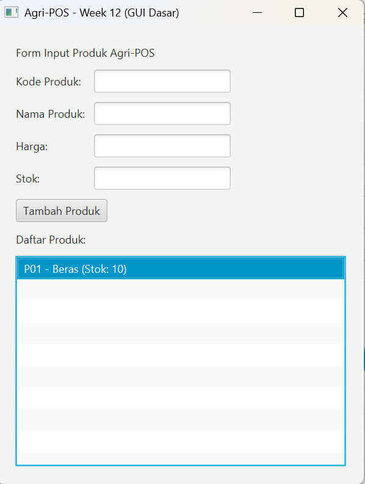

# Laporan Praktikum Minggu 12
Topik: GUI Dasar JavaFX (Event-Driven Programming)

## Identitas
- Nama  : Radika Rismawati Tri Prasaja
- NIM   : 240202905
- Kelas : 3IKRB

---

## Tujuan
1. Menjelaskan konsep event-driven programming.
2. Membangun antarmuka grafis sederhana menggunakan JavaFX.
3. Membuat form input data produk.
4. Menampilkan daftar produk pada GUI.
5. Mengintegrasikan GUI dengan modul backend yang telah dibuat (DAO & Service).

---

## Dasar Teori
- GUI (Graphical User Interface) adalah antarmuka grafis yang memungkinkan pengguna berinteraksi dengan aplikasi melalui komponen visual seperti tombol, text field, dan list.
- JavaFX merupakan library GUI pada Java yang mendukung pembuatan aplikasi desktop berbasis event-driven.
- Event-Driven Programming adalah paradigma pemrograman di mana alur program ditentukan oleh event, seperti klik tombol atau input pengguna.
- MVC (Model–View–Controller) digunakan untuk memisahkan logika bisnis, tampilan, dan pengendali agar kode lebih terstruktur dan mudah dikembangkan.
- DAO dan Service Layer digunakan untuk mengelola akses data ke database tanpa melibatkan layer GUI secara langsung.
- Dependency Inversion Principle (DIP) diterapkan dengan cara View tidak berinteraksi langsung dengan DAO, melainkan melalui Service.

---

## Langkah Praktikum
1. Menyiapkan project Java menggunakan Maven dengan dependency JavaFX dan PostgreSQL.
2. Membuat Model Product sebagai representasi data produk.
3. Mengimplementasikan ProductDAO untuk operasi CRUD ke database PostgreSQL.
4. Membuat ProductService sebagai perantara antara Controller dan DAO.
5. Mendesain GUI JavaFX berupa form input produk dan daftar produk.
6. Menghubungkan event tombol Tambah Produk menggunakan event handler JavaFX.
7. Mengimplementasikan ProductController untuk menangani interaksi antara View dan Service.
8. Menjalankan aplikasi menggunakan perintah:

   mvn javafx:run

9. Menguji aplikasi dengan menambahkan data produk melalui GUI dan menampilkan hasilnya pada ListView.
10. Mengambil screenshot GUI sebagai bukti praktikum.

---

## Kode Program
1. ProductController.java
```
package com.upb.agripos.controller;

import java.util.List;
import com.upb.agripos.model.Product;
import com.upb.agripos.service.ProductService;
import com.upb.agripos.view.ProductFormView;
import javafx.scene.control.Alert;

public class ProductController {
    private final ProductService service;
    private final ProductFormView view;

    public ProductController(ProductService service, ProductFormView view) {
        this.service = service;
        this.view = view;
        initController();
    }

    private void initController() {
        // Event Handler untuk tombol Tambah
        view.getBtnAdd().setOnAction(e -> addProduct());
        
        // Load data awal
        loadData();
    }

    private void addProduct() {
        try {
            String code = view.getTxtCode().getText();
            String name = view.getTxtName().getText();
            double price = Double.parseDouble(view.getTxtPrice().getText());
            int stock = Integer.parseInt(view.getTxtStock().getText());

            Product p = new Product(code, name, price, stock);
            service.addProduct(p);
            
            view.clearForm();
            loadData(); // Refresh list
        } catch (NumberFormatException ex) {
            new Alert(Alert.AlertType.ERROR, "Harga dan Stok harus berupa angka!").show();
        } catch (Exception ex) {
            new Alert(Alert.AlertType.ERROR, "Gagal menyimpan: " + ex.getMessage()).show();
        }
    }

    private void loadData() {
        view.getListView().getItems().clear();
        List<Product> products = service.getAllProducts();
        for (Product p : products) {
            view.getListView().getItems().add(p.getCode() + " - " + p.getName() + " (Stok: " + p.getStock() + ")");
        }
    }
}
```
2. ProductDAO.java
```
package com.upb.agripos.dao;

import java.util.List;

import com.upb.agripos.model.Product;

public interface ProductDAO {
    void insert(Product p);
    void update(Product p);
    void delete(String code);
    Product findByCode(String code);
    List<Product> findAll();
}
```
3. ProductDAOImpl.java
```
package com.upb.agripos.dao;

import java.sql.Connection;
import java.sql.PreparedStatement;
import java.sql.ResultSet;
import java.sql.SQLException;
import java.sql.Statement;
import java.util.ArrayList;
import java.util.List;

import com.upb.agripos.model.Product;

public class ProductDAOImpl implements ProductDAO {
    private Connection connection;

    public ProductDAOImpl(Connection connection) {
        this.connection = connection;
    }

    @Override
    public void insert(Product p) {
        String sql = "INSERT INTO products (code, name, price, stock) VALUES (?, ?, ?, ?)";
        try (PreparedStatement stmt = connection.prepareStatement(sql)) {
            stmt.setString(1, p.getCode());
            stmt.setString(2, p.getName());
            stmt.setDouble(3, p.getPrice());
            stmt.setInt(4, p.getStock());
            stmt.executeUpdate();
        } catch (SQLException e) {
            e.printStackTrace();
        }
    }

    @Override
    public void update(Product p) {
        String sql = "UPDATE products SET name = ?, price = ?, stock = ? WHERE code = ?";
        try (PreparedStatement stmt = connection.prepareStatement(sql)) {
            stmt.setString(1, p.getName());
            stmt.setDouble(2, p.getPrice());
            stmt.setInt(3, p.getStock());
            stmt.setString(4, p.getCode());
            stmt.executeUpdate();
        } catch (SQLException e) {
            e.printStackTrace();
        }
    }

    @Override
    public void delete(String code) {
        String sql = "DELETE FROM products WHERE code = ?";
        try (PreparedStatement stmt = connection.prepareStatement(sql)) {
            stmt.setString(1, code);
            stmt.executeUpdate();
        } catch (SQLException e) {
            e.printStackTrace();
        }
    }

    @Override
    public Product findByCode(String code) {
        String sql = "SELECT * FROM products WHERE code = ?";
        try (PreparedStatement stmt = connection.prepareStatement(sql)) {
            stmt.setString(1, code);
            try (ResultSet rs = stmt.executeQuery()) {
                if (rs.next()) {
                    return new Product(
                        rs.getString("code"),
                        rs.getString("name"),
                        rs.getDouble("price"),
                        rs.getInt("stock")
                    );
                }
            }
        } catch (SQLException e) {
            e.printStackTrace();
        }
        return null;
    }

    @Override
    public List<Product> findAll() {
        List<Product> list = new ArrayList<>();
        String sql = "SELECT * FROM products";
        try (Statement stmt = connection.createStatement();
             ResultSet rs = stmt.executeQuery(sql)) {
            while (rs.next()) {
                list.add(new Product(
                    rs.getString("code"),
                    rs.getString("name"),
                    rs.getDouble("price"),
                    rs.getInt("stock")
                ));
            }
        } catch (SQLException e) {
            e.printStackTrace();
        }
        return list;
    }
}
```
4. Product.java
```
package com.upb.agripos.model;

public class Product {
    private String code;
    private String name;
    private double price;
    private int stock;

    public Product(String code, String name, double price, int stock) {
        this.code = code;
        this.name = name;
        this.price = price;
        this.stock = stock;
    }

    public String getCode() {
        return code;
    }

    public void setCode(String code) {
        this.code = code;
    }

    public String getName() {
        return name;
    }

    public void setName(String name) {
        this.name = name;
    }

    public double getPrice() {
        return price;
    }

    public void setPrice(double price) {
        this.price = price;
    }

    public int getStock() {
        return stock;
    }

    public void setStock(int stock) {
        this.stock = stock;
    }
}
```
5. ProductService.java
```
package com.upb.agripos.service;

import java.util.List;

import com.upb.agripos.dao.ProductDAO;
import com.upb.agripos.model.Product;

public class ProductService {
    private final ProductDAO productDAO;

    public ProductService(ProductDAO productDAO) {
        this.productDAO = productDAO;
    }

    public void addProduct(Product product) {
        // Di sini bisa ditambahkan validasi bisnis jika perlu
        productDAO.insert(product);
    }

    public List<Product> getAllProducts() {
        return productDAO.findAll();
    }
}
```
6. ProductFormView.java
```
package com.upb.agripos.view;

import javafx.geometry.Insets;
import javafx.scene.control.Button;
import javafx.scene.control.Label;
import javafx.scene.control.ListView;
import javafx.scene.control.TextField;
import javafx.scene.layout.GridPane;
import javafx.scene.layout.VBox;

public class ProductFormView extends VBox {
    private TextField txtCode = new TextField();
    private TextField txtName = new TextField();
    private TextField txtPrice = new TextField();
    private TextField txtStock = new TextField();
    private Button btnAdd = new Button("Tambah Produk");
    private ListView<String> listView = new ListView<>();

    public ProductFormView() {
        setPadding(new Insets(20));
        setSpacing(10);

        // Form Layout
        GridPane grid = new GridPane();
        grid.setHgap(10);
        grid.setVgap(10);

        grid.add(new Label("Kode Produk:"), 0, 0);
        grid.add(txtCode, 1, 0);
        
        grid.add(new Label("Nama Produk:"), 0, 1);
        grid.add(txtName, 1, 1);
        
        grid.add(new Label("Harga:"), 0, 2);
        grid.add(txtPrice, 1, 2);
        
        grid.add(new Label("Stok:"), 0, 3);
        grid.add(txtStock, 1, 3);

        // Add components to VBox
        getChildren().addAll(
            new Label("Form Input Produk Agri-POS"),
            grid,
            btnAdd,
            new Label("Daftar Produk:"),
            listView
        );
    }

    public TextField getTxtCode() { return txtCode; }
    public TextField getTxtName() { return txtName; }
    public TextField getTxtPrice() { return txtPrice; }
    public TextField getTxtStock() { return txtStock; }
    public Button getBtnAdd() { return btnAdd; }
    public ListView<String> getListView() { return listView; }

    public void clearForm() {
        txtCode.clear();
        txtName.clear();
        txtPrice.clear();
        txtStock.clear();
        txtCode.requestFocus();
    }
}
```
7. AppJavaFX.java
```
package com.upb.agripos;

import java.sql.Connection;
import java.sql.DriverManager;

import com.upb.agripos.controller.ProductController;
import com.upb.agripos.dao.ProductDAO;
import com.upb.agripos.dao.ProductDAOImpl;
import com.upb.agripos.service.ProductService;
import com.upb.agripos.view.ProductFormView;

import javafx.application.Application;
import javafx.scene.Scene;
import javafx.stage.Stage;

public class AppJavaFX extends Application {

    @Override
    public void start(Stage stage) {
        try {
            Class.forName("org.postgresql.Driver");
            // 1. Setup Database Connection
            Connection conn = DriverManager.getConnection(
                "jdbc:postgresql://localhost:5432/agripos", "postgres", "Radika201005"
            );

            // 2. Setup MVC Components
            ProductDAO dao = new ProductDAOImpl(conn);
            ProductService service = new ProductService(dao);
            ProductFormView view = new ProductFormView();
            new ProductController(service, view); // Controller menghubungkan View & Service

            // 3. Setup Scene & Stage
            Scene scene = new Scene(view, 400, 500);
            stage.setTitle("Agri-POS - Week 12 (GUI Dasar)");
            stage.setScene(scene);
            stage.show();
        } catch (Exception e) {
            e.printStackTrace();
        }
    }

    public static void main(String[] args) {
        Application.launch(args);
    }
}
```
8. Launcher.java
```
package com.upb.agripos;

public class Launcher {
    public static void main(String[] args) {
        AppJavaFX.main(args);
    }
}
```
9. pom.xml
```
<project xmlns="http://maven.apache.org/POM/4.0.0"
    xmlns:xsi="http://www.w3.org/2001/XMLSchema-instance"
    xsi:schemaLocation="http://maven.apache.org/POM/4.0.0 http://maven.apache.org/xsd/maven-4.0.0.xsd">
    <modelVersion>4.0.0</modelVersion>

    <groupId>com.upb.agripos</groupId>
    <artifactId>week12-gui-dasar</artifactId>
    <version>1.0-SNAPSHOT</version>

    <properties>
        <maven.compiler.release>17</maven.compiler.release>
        <project.build.sourceEncoding>UTF-8</project.build.sourceEncoding>
        <javafx.version>17.0.2</javafx.version>
    </properties>

    <dependencies>
        <dependency>
            <groupId>org.postgresql</groupId>
            <artifactId>postgresql</artifactId>
            <version>42.7.2</version>
        </dependency>
        <dependency>
            <groupId>org.openjfx</groupId>
            <artifactId>javafx-controls</artifactId>
            <version>${javafx.version}</version>
        </dependency>
        <dependency>
            <groupId>org.openjfx</groupId>
            <artifactId>javafx-fxml</artifactId>
            <version>${javafx.version}</version>
        </dependency>
    </dependencies>

    <build>
        <plugins>
            <plugin>
                <groupId>org.apache.maven.plugins</groupId>
                <artifactId>maven-compiler-plugin</artifactId>
                <version>3.11.0</version>
            </plugin>
            <plugin>
                <groupId>org.openjfx</groupId>
                <artifactId>javafx-maven-plugin</artifactId>
                <version>0.0.8</version>
                <configuration>
                    <mainClass>com.upb.agripos.AppJavaFX</mainClass>
                </configuration>
            </plugin>
        </plugins>
    </build>
</project>
```
---

## Hasil Eksekusi

---

## Analisis
1. Jelaskan bagaimana kode berjalan! 
Jawab: Aplikasi berjalan dengan pendekatan event-driven programming menggunakan JavaFX. Ketika aplikasi dijalankan, kelas AppJavaFX akan menginisialisasi koneksi database, membuat objek DAO, Service, View, dan Controller sesuai pola MVC.
Saat pengguna menekan tombol Tambah Produk, event handler pada ProductController akan mengambil data dari komponen input di ProductFormView, kemudian membentuk objek Product. Objek tersebut diteruskan ke ProductService, yang selanjutnya memanggil ProductDAO untuk menyimpan data ke database PostgreSQL. Setelah proses penyimpanan berhasil, daftar produk pada GUI diperbarui dengan mengambil ulang data dari database dan menampilkannya pada ListView.

2. Apa perbedaan pendekatan minggu ini dibanding minggu sebelumnya? 
Jawab: Pada Week 11, aplikasi dijalankan berbasis console dan interaksi pengguna dilakukan melalui input teks di terminal. Fokus utama praktikum adalah implementasi DAO, JDBC, dan operasi CRUD secara langsung ke database PostgreSQL.

Sedangkan pada Week 12, aplikasi dikembangkan menggunakan JavaFX sehingga interaksi dilakukan melalui GUI. Logika CRUD yang telah dibuat pada Week 11 tetap digunakan tanpa perubahan, namun cara pengguna berinteraksi dengan sistem berubah menjadi event-driven. Dengan demikian, Week 12 menunjukkan bagaimana aplikasi backend berbasis DAO dapat diintegrasikan dengan frontend GUI tanpa melanggar prinsip pemisahan tanggung jawab.

3. Kendala yang dihadapi dan cara mengatasinya
Jawab:Kendala yang dihadapi antara lain konfigurasi awal JavaFX pada project Maven dan penyesuaian struktur package agar sesuai dengan standar Maven. Selain itu, daftar produk pada awal aplikasi tampil kosong karena database belum memiliki data. Kendala tersebut diatasi dengan menggunakan plugin javafx-maven-plugin untuk menjalankan aplikasi serta menambahkan data produk melalui GUI agar data tersimpan ke database dan langsung ditampilkan pada ListView.
---

## Kesimpulan
Berdasarkan praktikum Minggu 12 yang telah dilakukan, dapat disimpulkan bahwa penggunaan JavaFX memungkinkan pembuatan aplikasi berbasis GUI yang interaktif dan bersifat event-driven. Integrasi GUI dengan arsitektur MVC serta DAO dan Service Layer dari Minggu 11 dapat dilakukan tanpa mengulang logika CRUD, sehingga struktur aplikasi tetap terjaga dan sesuai prinsip SOLID. Dengan pendekatan ini, aplikasi menjadi lebih modular, mudah dikembangkan, dan memiliki pemisahan tanggung jawab yang jelas antara antarmuka, logika bisnis, dan akses data.
---

# Traceability Bab 6 (UML) → GUI

| Artefak Bab 6 | Referensi | Handler GUI | Controller/Service | DAO | Dampak UI/DB |
|---------------|-----------|-------------|-------------------|-----|--------------|
| **Use Case** | UC-01 Kelola Produk | Tombol Tambah/Edit/Hapus | `ProductController` → `ProductService` | `ProductDAO.insert/update/delete()` | UI list produk + DB CRUD Produk |
| **Use Case** | UC-02 Proses Transaksi | Tombol Checkout | `TransaksiController.checkout()` → `PaymentService.pilihMetodePembayaran()` | `TransaksiDAO` | UI keranjang → pilih metode → konfirmasi + DB insert |
| **Activity Diagram** | AD-01 Kelola Produk | Tombol aksi produk | Validasi input & panggil service | `insert()/update()/delete()` | validasi → proses → tampil hasil |
| **Activity Diagram** | AD-02 Proses Transaksi | Pilih Metode Pembayaran | `PaymentService` → Cash/E-Wallet/Transfer | Sesuai metode | Pilih → validasi → konfirmasi pembayaran |
| **Sequence Diagram** | SD-01 Kelola Produk | Form Input | View → Controller → Service | DAO → DB | urutan panggilan sesuai SD |
| **Sequence Diagram** | SD-02 Transaksi Cash | Checkout → Input Cash | `PaymentService.hitungKembalian()` → `NotaService.cetakNota()` | `TransaksiDAO` | Input uang → kembalian → nota |
| **Sequence Diagram** | SD-03 Transaksi E-Wallet | Checkout → E-Wallet | `PaymentService` → `PaymentGateway` → `NotaService` | - | Request → validasi → nota |
| **Sequence Diagram** | SD-04 Transaksi Transfer | Checkout → Upload Bukti | `PaymentService` → `BankValidator` → `PaymentGateway` | - | Upload → validasi → konfirmasi |
