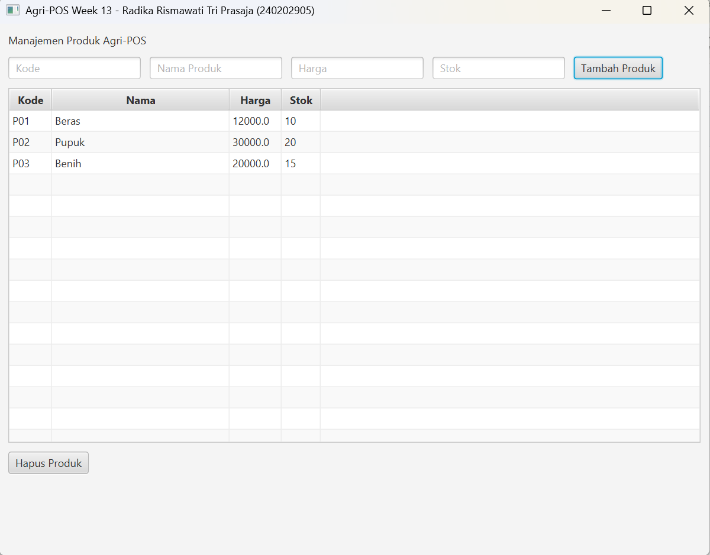

# Laporan Praktikum Minggu 13
Topik: GUI Lanjutan JavaFX (TableView dan Lambda Expression)

## Identitas
- Nama  : Radika Rismawati Tri Prasaja
- NIM   : 240202905
- Kelas : 3IKRB

---

## Tujuan
1. Menampilkan data menggunakan TableView JavaFX.
2. Mengintegrasikan koleksi objek dengan GUI.
3. Menggunakan lambda expression untuk event handling.
4. Menghubungkan GUI dengan DAO secara penuh.
5. Membangun antarmuka GUI Agri-POS yang lebih interaktif.

---

## Dasar Teori
1. TableView: Komponen JavaFX untuk menampilkan data tabular dari database secara dinamis.
2. Lambda Expression: Digunakan sebagai event handler tombol (Tambah/Hapus) agar kode lebih ringkas dan interaktif.
3. MVC & SOLID: GUI (View) hanya menampilkan data; logika bisnis dan operasi CRUD ditangani Service/DAO.
4. Integrasi Database: Data diambil dari PostgreSQL menggunakan JDBC dan diikat ke TableView melalui ObservableList.

---

## Langkah Praktikum
1. Siapkan project Week 12 & database agripos dengan tabel products.
2. Buat TableView di ProductTableView.java + form input + tombol Tambah/Hapus.
3. Buat Controller (ProductController.java) pakai lambda untuk event tombol dan load data.
4. Buat Service & DAO untuk logika bisnis & CRUD ke PostgreSQL.
5. Hubungkan Controller → View → Service → DAO di AppJavaFX.java.
6. Jalankan project dengan Maven (mvn clean javafx:run) dan cek TableView menampilkan data.

---

## Kode Program
1. ProductController.java
```
package com.upb.agripos.controller;

import com.upb.agripos.model.Product;
import com.upb.agripos.service.ProductService;
import com.upb.agripos.view.ProductTableView;
import javafx.collections.FXCollections;
import javafx.collections.ObservableList;
import javafx.scene.control.Alert;

public class ProductController {
    private final ProductService service;
    private final ProductTableView view;

    public ProductController(ProductService service, ProductTableView view) {
        this.service = service;
        this.view = view;
        initController();
        loadData();
    }

    private void initController() {
        // Event Handler: Tambah Produk (Lambda)
        view.getBtnAdd().setOnAction(e -> {
            try {
                Product p = view.getProductFromInput();
                service.addProduct(p);
                loadData();
                view.clearInput();
            } catch (NumberFormatException ex) {
                showAlert("Input Error", "Harga dan Stok harus angka.");
            } catch (Exception ex) {
                showAlert("Error", "Gagal menyimpan: " + ex.getMessage());
            }
        });

        // Event Handler: Hapus Produk (Lambda)
        view.getBtnDelete().setOnAction(e -> {
            Product selected = view.getTable().getSelectionModel().getSelectedItem();
            if (selected != null) {
                try {
                    service.deleteProduct(selected.getCode());
                    loadData();
                } catch (Exception ex) {
                    showAlert("Error", "Gagal menghapus: " + ex.getMessage());
                }
            } else {
                showAlert("Warning", "Pilih produk yang akan dihapus.");
            }
        });
    }

    private void loadData() {
        try {
            ObservableList<Product> data = FXCollections.observableArrayList(service.getAllProducts());
            view.getTable().setItems(data);
        } catch (Exception e) {
            showAlert("Error", "Gagal memuat data: " + e.getMessage());
        }
    }

    private void showAlert(String title, String content) {
        Alert alert = new Alert(Alert.AlertType.INFORMATION);
        alert.setTitle(title);
        alert.setContentText(content);
        alert.showAndWait();
    }
}
```
2. ProductDAO.java
```
package com.upb.agripos.dao;

import java.util.List;

import com.upb.agripos.model.Product;

public interface ProductDAO {
    void insert(Product product) throws Exception;
    void delete(String code) throws Exception;
    List<Product> findAll() throws Exception;
}
```
3. ProductDAOImpl.java
```
package com.upb.agripos.dao;

import com.upb.agripos.model.Product;
import java.sql.*;
import java.util.ArrayList;
import java.util.List;

public class ProductDAOImpl implements ProductDAO {
    private final Connection connection;

    public ProductDAOImpl(Connection connection) {
        this.connection = connection;
    }

    @Override
    public void insert(Product p) throws Exception {
        String sql = "INSERT INTO products(code, name, price, stock) VALUES (?, ?, ?, ?)";
        try (PreparedStatement ps = connection.prepareStatement(sql)) {
            ps.setString(1, p.getCode());
            ps.setString(2, p.getName());
            ps.setDouble(3, p.getPrice());
            ps.setInt(4, p.getStock());
            ps.executeUpdate();
        }
    }

    @Override
    public void delete(String code) throws Exception {
        String sql = "DELETE FROM products WHERE code=?";
        try (PreparedStatement ps = connection.prepareStatement(sql)) {
            ps.setString(1, code);
            ps.executeUpdate();
        }
    }

    @Override
    public List<Product> findAll() throws Exception {
        List<Product> list = new ArrayList<>();
        String sql = "SELECT * FROM products";
        try (Statement st = connection.createStatement();
             ResultSet rs = st.executeQuery(sql)) {
            while (rs.next()) {
                list.add(new Product(rs.getString("code"), rs.getString("name"), rs.getDouble("price"), rs.getInt("stock")));
            }
        }
        return list;
    }
}
```
4. Product.java
```
package com.upb.agripos.model;

public class Product {
    private String code;
    private String name;
    private double price;
    private int stock;

    public Product(String code, String name, double price, int stock) {
        this.code = code;
        this.name = name;
        this.price = price;
        this.stock = stock;
    }

    public String getCode() { return code; }
    public void setCode(String code) { this.code = code; }

    public String getName() { return name; }
    public void setName(String name) { this.name = name; }

    public double getPrice() { return price; }
    public void setPrice(double price) { this.price = price; }

    public int getStock() { return stock; }
    public void setStock(int stock) { this.stock = stock; }
}
```
5. ProductService.java
```
package com.upb.agripos.service;

import java.util.List;

import com.upb.agripos.dao.ProductDAO;
import com.upb.agripos.model.Product;

public class ProductService {
    private final ProductDAO productDAO;

    public ProductService(ProductDAO productDAO) {
        this.productDAO = productDAO;
    }

    public void addProduct(Product p) throws Exception {
        // Validasi sederhana bisa ditambahkan di sini
        if (p.getPrice() < 0) throw new Exception("Harga tidak boleh negatif");
        productDAO.insert(p);
    }

    public void deleteProduct(String code) throws Exception {
        productDAO.delete(code);
    }

    public List<Product> getAllProducts() throws Exception {
        return productDAO.findAll();
    }
}

```
6. ProductTableView.java
```
package com.upb.agripos.view;

import com.upb.agripos.model.Product;

import javafx.geometry.Insets;
import javafx.scene.control.Button;
import javafx.scene.control.Label;
import javafx.scene.control.TableColumn;
import javafx.scene.control.TableView;
import javafx.scene.control.TextField;
import javafx.scene.control.cell.PropertyValueFactory;
import javafx.scene.layout.HBox;
import javafx.scene.layout.VBox;

public class ProductTableView extends VBox {
    private TextField txtCode = new TextField();
    private TextField txtName = new TextField();
    private TextField txtPrice = new TextField();
    private TextField txtStock = new TextField();
    private Button btnAdd = new Button("Tambah Produk");
    private Button btnDelete = new Button("Hapus Produk");
    private TableView<Product> table = new TableView<>();

    public ProductTableView() {
        setSpacing(10);
        setPadding(new Insets(10));

        // Setup Input Form
        txtCode.setPromptText("Kode");
        txtName.setPromptText("Nama Produk");
        txtPrice.setPromptText("Harga");
        txtStock.setPromptText("Stok");

        HBox formBox = new HBox(10, txtCode, txtName, txtPrice, txtStock, btnAdd);
        
        // Setup Table Columns
        TableColumn<Product, String> colCode = new TableColumn<>("Kode");
        colCode.setCellValueFactory(new PropertyValueFactory<>("code"));

        TableColumn<Product, String> colName = new TableColumn<>("Nama");
        colName.setCellValueFactory(new PropertyValueFactory<>("name"));
        colName.setMinWidth(200);

        TableColumn<Product, Double> colPrice = new TableColumn<>("Harga");
        colPrice.setCellValueFactory(new PropertyValueFactory<>("price"));

        TableColumn<Product, Integer> colStock = new TableColumn<>("Stok");
        colStock.setCellValueFactory(new PropertyValueFactory<>("stock"));

        table.getColumns().addAll(colCode, colName, colPrice, colStock);

        // Add components
        getChildren().addAll(new Label("Manajemen Produk Agri-POS"), formBox, table, btnDelete);
    }

    // Getters for Controller
    public Button getBtnAdd() { return btnAdd; }
    public Button getBtnDelete() { return btnDelete; }
    public TableView<Product> getTable() { return table; }

    public Product getProductFromInput() throws NumberFormatException {
        return new Product(
            txtCode.getText(),
            txtName.getText(),
            Double.parseDouble(txtPrice.getText()),
            Integer.parseInt(txtStock.getText())
        );
    }

    public void clearInput() {
        txtCode.clear();
        txtName.clear();
        txtPrice.clear();
        txtStock.clear();
    }
}
```
7. AppJavaFX.java
```
package com.upb.agripos;

import java.sql.Connection;
import java.sql.DriverManager;

import com.upb.agripos.controller.ProductController;
import com.upb.agripos.dao.ProductDAO;
import com.upb.agripos.dao.ProductDAOImpl;
import com.upb.agripos.service.ProductService;
import com.upb.agripos.view.ProductTableView;

import javafx.application.Application;
import javafx.scene.Scene;
import javafx.stage.Stage;

public class AppJavaFX extends Application {

    @Override
    public void start(Stage stage) {
        try {
            // 1. Setup Database Connection
            Connection conn = DriverManager.getConnection(
                "jdbc:postgresql://localhost:5432/agripos", "postgres", "Radika201005"
            );

            // 2. Setup MVC Components
            ProductDAO dao = new ProductDAOImpl(conn);
            ProductService service = new ProductService(dao);
            ProductTableView view = new ProductTableView();
            new ProductController(service, view);

            // 3. Show Scene
            Scene scene = new Scene(view, 800, 600);
            stage.setTitle("Agri-POS Week 13 - Radika Rismawati Tri Prasaja (240202905)");
            stage.setScene(scene);
            stage.show();

        } catch (Exception e) {
            e.printStackTrace();
        }
    }

    public static void main(String[] args) {
        launch(args);
    }
}
```
8. Launcher.java
```
package com.upb.agripos;

public class Launcher {
    public static void main(String[] args) {
        AppJavaFX.main(args);
    }
}
```
9. pom.xml
```
<project xmlns="http://maven.apache.org/POM/4.0.0"
         xmlns:xsi="http://www.w3.org/2001/XMLSchema-instance"
         xsi:schemaLocation="http://maven.apache.org/POM/4.0.0 http://maven.apache.org/xsd/maven-4.0.0.xsd">
    <modelVersion>4.0.0</modelVersion>

    <groupId>com.upb.agripos</groupId>
    <artifactId>week13-gui-lanjutan</artifactId>
    <version>1.0-SNAPSHOT</version>

    <properties>
        <maven.compiler.source>17</maven.compiler.source>
        <maven.compiler.target>17</maven.compiler.target>
        <project.build.sourceEncoding>UTF-8</project.build.sourceEncoding>
        <javafx.version>17.0.6</javafx.version>
    </properties>

    <dependencies>
        <!-- JavaFX Controls -->
        <dependency>
            <groupId>org.openjfx</groupId>
            <artifactId>javafx-controls</artifactId>
            <version>${javafx.version}</version>
        </dependency>
        
        <!-- JavaFX FXML (Optional, but good practice) -->
        <dependency>
            <groupId>org.openjfx</groupId>
            <artifactId>javafx-fxml</artifactId>
            <version>${javafx.version}</version>
        </dependency>

        <!-- PostgreSQL Driver -->
        <dependency>
            <groupId>org.postgresql</groupId>
            <artifactId>postgresql</artifactId>
            <version>42.6.0</version>
        </dependency>
    </dependencies>

    <build>
        <plugins>
            <plugin>
                <groupId>org.apache.maven.plugins</groupId>
                <artifactId>maven-compiler-plugin</artifactId>
                <version>3.8.1</version>
            </plugin>
            <plugin>
                <groupId>org.openjfx</groupId>
                <artifactId>javafx-maven-plugin</artifactId>
                <version>0.0.8</version>
                <configuration>
                    <mainClass>com.upb.agripos.AppJavaFX</mainClass>
                </configuration>
            </plugin>
        </plugins>
    </build>
</project>
```

---

## Hasil Eksekusi

---

## Analisis
1. Jelaskan bagaimana kode berjalan!
Jawab: Aplikasi Week 13 berjalan dengan pendekatan MVC dan event-driven programming menggunakan JavaFX. Saat aplikasi dijalankan, AppJavaFX membuat koneksi ke database PostgreSQL, kemudian menginisialisasi objek DAO (ProductDAOImpl), Service (ProductService), View (ProductTableView), dan Controller (ProductController).
Data produk diambil dari database melalui ProductService.getAllProducts() dan ditampilkan di TableView. Saat pengguna menekan tombol Tambah Produk, event handler lambda pada Controller akan membaca input dari form, membuat objek Product, memanggil Service untuk menyimpan ke database, dan melakukan reload TableView agar data baru muncul. Tombol Hapus Produk bekerja serupa: Controller memanggil Service untuk menghapus data sesuai kode produk, lalu TableView diperbarui secara otomatis.
Dengan cara ini, semua interaksi pengguna tetap terstruktur, View tidak langsung berhubungan dengan DAO, dan prinsip SOLID (terutama DIP) tetap dipenuhi.

2. Apa perbedaan pendekatan minggu ini dibanding minggu sebelumnya? 
Jawab: Pada Week 12, GUI menggunakan ListView untuk menampilkan daftar produk, dan interaksi dilakukan melalui tombol tambah saja, dengan event handler langsung menangani data dari form ke Service.
Pada Week 13, GUI ditingkatkan menggunakan TableView yang lebih interaktif, memungkinkan melihat kolom kode, nama, harga, dan stok secara rapi. Event handling menggunakan lambda expression yang lebih ringkas dan elegan. Selain itu, operasi hapus produk ditambahkan sehingga GUI sudah bisa melakukan CRUD penuh (Tambah/Hapus/Reload) secara langsung dari database. Dengan demikian, Week 13 lebih mendekati aplikasi desktop profesional dibanding Week 12 yang masih sederhana.

3. Kendala yang dihadapi dan cara mengatasinya
Jawab: Beberapa kendala yang ditemui antara lain:

- TableView tidak menampilkan data: karena ObservableList belum diisi atau properti nama kolom (PropertyValueFactory) tidak sesuai nama field di class Product.
Solusi: Pastikan PropertyValueFactory<>("code") sesuai dengan getter getCode() di Product, dan panggil loadData() setelah setiap operasi.

- Error koneksi database: kadang muncul karena PostgreSQL belum dijalankan atau kredensial salah.
Solusi: Pastikan server PostgreSQL aktif, database agripos tersedia, username/password benar.

- Package merah / Maven belum refresh: karena dependency JavaFX belum diunduh.
Solusi: Jalankan mvn clean compile atau refresh project Maven di IDE.

Dengan mengatasi kendala tersebut, aplikasi berhasil menampilkan TableView yang terhubung penuh ke database, tombol tambah dan hapus berfungsi, dan event handler menggunakan lambda expression berjalan sesuai rencana.

---

## Kesimpulan
Pada praktikum Week 13, aplikasi Agri-POS berhasil dikembangkan dengan tampilan GUI yang lebih interaktif menggunakan TableView JavaFX. Data produk dapat ditampilkan secara dinamis dari database PostgreSQL, dan operasi tambah atau hapus produk dapat dilakukan langsung melalui GUI. Penggunaan lambda expression mempermudah penanganan event tombol sehingga kode lebih ringkas dan mudah dibaca. Praktikum ini juga menegaskan penerapan prinsip MVC dan SOLID, di mana View hanya menampilkan data, sedangkan logika bisnis dan operasi CRUD ditangani oleh Service dan DAO. Secara keseluruhan, GUI Week 13 siap digunakan sebagai dasar integrasi akhir aplikasi Agri-POS.

---


