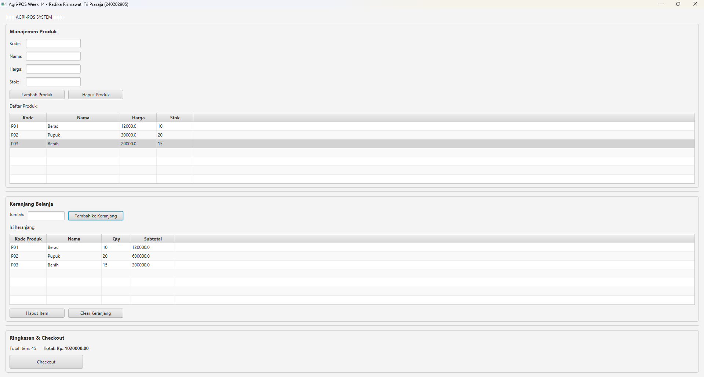
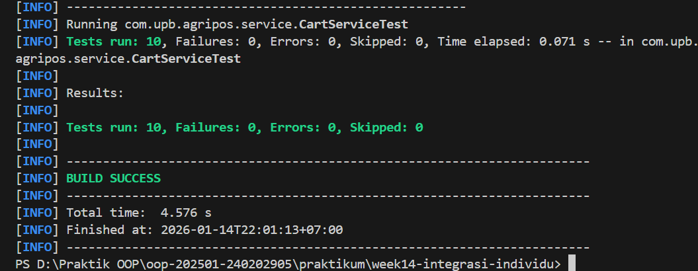

# Laporan Praktikum Minggu 14
Topik: Integrasi Individu (OOP + Database + GUI)

## Identitas
- Nama  : Radika Rismawati Tri Prasaja
- NIM   : 240202905
- Kelas : 3IKRB

---

## Tujuan
1. Mengintegrasikan konsep OOP (Bab 1–5) ke dalam satu aplikasi yang utuh.
2. Mengimplementasikan rancangan UML + SOLID (Bab 6) menjadi kode nyata.
3. Mengintegrasikan Collections + Keranjang (Bab 7) ke alur aplikasi.
4. Menerapkan exception handling (Bab 9) untuk validasi dan error flow.
5. Menerapkan pattern + unit testing (Bab 10) pada bagian yang relevan.
6. Menghubungkan aplikasi dengan database via DAO + JDBC (Bab 11).
7. Menyajikan aplikasi berbasis JavaFX (Bab 12–13) yang terhubung ke backend.

---

## Dasar Teori
1. Integrasi OOP, JavaFX, dan PostgreSQL (DAO + JDBC).
2. Arsitektur MVC + Service + DAO sesuai SOLID & DIP.
3. Keranjang menggunakan Collections (List / Map).
4. Input & error flow pakai Exception Handling.
5. Menggunakan Design Pattern (misal Singleton untuk DB).
6. Unit testing dengan JUnit untuk logika non-GUI.
7. Alur end-to-end: DB → GUI → keranjang → total → (opsional) receipt.
8. Identitas praktikum tampil di console: Hello World, I am [Nama]-[NIM].

---

## Langkah Praktikum
1. Siapkan Maven project & dependency (JavaFX, PostgreSQL, JUnit).
2. Pastikan tabel products di PostgreSQL ada & koneksi JDBC benar.
3. Jalankan unit test: mvn clean test → ambil SS junit_result.png.
4. Jalankan GUI: mvn clean javafx:run → TableView produk + Add to Cart → ambil SS app_main.png.
5. Tambahkan tombol Checkout untuk popup receipt → ambil SS receipt.png.
6. Pastikan Collections (keranjang), Exception Handling, dan layer MVC/Service/DAO berfungsi.

---

## Kode Program
1. PosController.java
```
package com.upb.agripos.controller;

import com.upb.agripos.model.CartItem;
import com.upb.agripos.model.Product;
import com.upb.agripos.service.CartService;
import com.upb.agripos.service.ProductService;
import com.upb.agripos.view.PosView;

import javafx.collections.FXCollections;
import javafx.collections.ObservableList;
import javafx.scene.control.Alert;

/**
 * Controller untuk POS Application
 * Menerapkan pola MVC dari Bab 12-13
 * Menerapkan DIP: View → Controller → Service → DAO
 */
public class PosController {
    private final ProductService productService;
    private final CartService cartService;
    private final PosView view;

    public PosController(ProductService productService, CartService cartService, PosView view) {
        this.productService = productService;
        this.cartService = cartService;
        this.view = view;
        initController();
        loadProductData();
        updateCartDisplay();
    }

    /**
     * Menginisialisasi event handler untuk semua button
     */
    private void initController() {
        // Event Handler: Tambah Produk
        view.getBtnAddProduct().setOnAction(e -> handleAddProduct());

        // Event Handler: Hapus Produk
        view.getBtnDeleteProduct().setOnAction(e -> handleDeleteProduct());

        // Event Handler: Tambah ke Keranjang
        view.getBtnAddToCart().setOnAction(e -> handleAddToCart());

        // Event Handler: Hapus dari Keranjang
        view.getBtnRemoveFromCart().setOnAction(e -> handleRemoveFromCart());

        // Event Handler: Clear Keranjang
        view.getBtnClearCart().setOnAction(e -> handleClearCart());

        // Event Handler: Checkout
        view.getBtnCheckout().setOnAction(e -> handleCheckout());
    }

    /**
     * Memuat daftar produk dari database ke TableView
     */
    private void loadProductData() {
        try {
            ObservableList<Product> data = FXCollections.observableArrayList(
                productService.getAllProducts()
            );
            view.getProductTable().setItems(data);
        } catch (Exception e) {
            showAlert("Error", "Gagal memuat data produk: " + e.getMessage());
        }
    }

    /**
     * Handle: Tambah Produk
     */
    private void handleAddProduct() {
        try {
            Product p = view.getProductFromInput();
            productService.addProduct(p);
            loadProductData();
            view.clearProductInput();
            showAlert("Success", "Produk berhasil ditambahkan!");
        } catch (NumberFormatException ex) {
            showAlert("Input Error", "Harga dan Stok harus berupa angka");
        } catch (IllegalArgumentException ex) {
            showAlert("Validasi Error", ex.getMessage());
        } catch (Exception ex) {
            showAlert("Error", "Gagal menyimpan: " + ex.getMessage());
        }
    }

    /**
     * Handle: Hapus Produk
     */
    private void handleDeleteProduct() {
        Product selected = view.getProductTable().getSelectionModel().getSelectedItem();
        if (selected == null) {
            showAlert("Warning", "Pilih produk yang akan dihapus");
            return;
        }

        try {
            productService.deleteProduct(selected.getCode());
            loadProductData();
            showAlert("Success", "Produk berhasil dihapus!");
        } catch (Exception ex) {
            showAlert("Error", "Gagal menghapus: " + ex.getMessage());
        }
    }

    /**
     * Handle: Tambah ke Keranjang
     */
    private void handleAddToCart() {
        Product selected = view.getProductTable().getSelectionModel().getSelectedItem();
        if (selected == null) {
            showAlert("Warning", "Pilih produk yang akan ditambahkan ke keranjang");
            return;
        }

        try {
            int quantity = view.getQuantityFromInput();
            if (quantity <= 0) {
                showAlert("Validasi", "Jumlah harus lebih dari 0");
                return;
            }

            cartService.addItemToCart(selected.getCode(), quantity);
            updateCartDisplay();
            view.clearQuantityInput();
            showAlert("Success", "Item berhasil ditambahkan ke keranjang!");
        } catch (NumberFormatException ex) {
            showAlert("Input Error", "Jumlah harus berupa angka");
        } catch (IllegalArgumentException ex) {
            showAlert("Validasi Error", ex.getMessage());
        } catch (Exception ex) {
            showAlert("Error", ex.getMessage());
        }
    }

    /**
     * Handle: Hapus dari Keranjang
     */
    private void handleRemoveFromCart() {
        CartItem selected = view.getCartTable().getSelectionModel().getSelectedItem();
        if (selected == null) {
            showAlert("Warning", "Pilih item yang akan dihapus dari keranjang");
            return;
        }

        try {
            cartService.removeItemFromCart(selected.getProduct().getCode());
            updateCartDisplay();
            showAlert("Success", "Item berhasil dihapus dari keranjang!");
        } catch (Exception ex) {
            showAlert("Error", ex.getMessage());
        }
    }

    /**
     * Handle: Clear Keranjang
     */
    private void handleClearCart() {
        if (cartService.isCartEmpty()) {
            showAlert("Info", "Keranjang sudah kosong");
            return;
        }

        cartService.clearCart();
        updateCartDisplay();
        showAlert("Success", "Keranjang telah dikosongkan");
    }

    /**
     * Handle: Checkout
     * Mencetak struk dan mengosongkan keranjang
     */
    private void handleCheckout() {
        if (cartService.isCartEmpty()) {
            showAlert("Warning", "Keranjang kosong, tidak ada yang perlu di-checkout");
            return;
        }

        try {
            printReceipt();
            cartService.clearCart();
            updateCartDisplay();
            showAlert("Success", "Checkout berhasil! Terima kasih atas pembelian Anda.");
        } catch (Exception ex) {
            showAlert("Error", "Gagal melakukan checkout: " + ex.getMessage());
        }
    }

    /**
     * Mencetak struk ke console
     */
    private void printReceipt() {
        System.out.println("\n========== AGRI-POS RECEIPT ==========");
        System.out.println("Nama Kasir: Wahyu Tri Cahya (240202889)");
        System.out.println("-------------------------------------");
        
        for (CartItem item : cartService.getCartItems()) {
            System.out.printf("%s x%d = Rp. %.2f%n",
                item.getProduct().getName(),
                item.getQuantity(),
                item.getSubtotal()
            );
        }

        System.out.println("-------------------------------------");
        System.out.printf("TOTAL: Rp. %.2f%n", cartService.getCartTotal());
        System.out.println("=====================================\n");
    }

    /**
     * Mengupdate tampilan keranjang
     */
    private void updateCartDisplay() {
        try {
            ObservableList<CartItem> cartData = FXCollections.observableArrayList(
                cartService.getCartItems()
            );
            view.getCartTable().setItems(cartData);
            view.updateCartSummary(
                cartService.getCartItemCount(),
                cartService.getCartTotal()
            );
        } catch (Exception e) {
            showAlert("Error", "Gagal mengupdate tampilan keranjang: " + e.getMessage());
        }
    }

    /**
     * Menampilkan alert dialog
     */
    private void showAlert(String title, String content) {
        Alert alert = new Alert(Alert.AlertType.INFORMATION);
        alert.setTitle(title);
        alert.setContentText(content);
        alert.showAndWait();
    }
}
```
2. ProductService.java
```
package com.upb.agripos.service;

import java.util.List;

import com.upb.agripos.dao.ProductDAO;
import com.upb.agripos.model.Product;

/**
 * Service layer untuk Product
 * Mengikuti pattern MVC dari Bab 12-13
 * Menerapkan DIP (Dependency Inversion Principle) dari Bab 6
 * Service bergantung pada abstraksi (ProductDAO interface), bukan implementasi konkret
 */
public class ProductService {
    private final ProductDAO productDAO;

    public ProductService(ProductDAO productDAO) {
        this.productDAO = productDAO;
    }

    /**
     * Menambah produk baru
     * Validasi dilakukan sebelum memanggil DAO
     */
    public void addProduct(Product product) throws Exception {
        if (product.getCode() == null || product.getCode().trim().isEmpty()) {
            throw new IllegalArgumentException("Kode produk tidak boleh kosong");
        }
        if (product.getName() == null || product.getName().trim().isEmpty()) {
            throw new IllegalArgumentException("Nama produk tidak boleh kosong");
        }
        if (product.getPrice() < 0) {
            throw new IllegalArgumentException("Harga harus positif");
        }
        if (product.getStock() < 0) {
            throw new IllegalArgumentException("Stok harus positif");
        }

        productDAO.insert(product);
    }

    /**
     * Mengambil semua produk dari database
     */
    public List<Product> getAllProducts() throws Exception {
        return productDAO.findAll();
    }

    /**
     * Mencari produk berdasarkan kode
     */
    public Product getProductByCode(String code) throws Exception {
        return productDAO.findByCode(code);
    }

    /**
     * Menghapus produk berdasarkan kode
     */
    public void deleteProduct(String code) throws Exception {
        productDAO.delete(code);
    }

    /**
     * Mengubah data produk
     */
    public void updateProduct(Product product) throws Exception {
        productDAO.update(product);
    }
}
```
3. PosView.java
```
package com.upb.agripos.view;

import com.upb.agripos.model.CartItem;
import com.upb.agripos.model.Product;

import javafx.geometry.Insets;
import javafx.scene.control.Button;
import javafx.scene.control.Label;
import javafx.scene.control.Separator;
import javafx.scene.control.TableColumn;
import javafx.scene.control.TableView;
import javafx.scene.control.TextField;
import javafx.scene.control.cell.PropertyValueFactory;
import javafx.scene.layout.GridPane;
import javafx.scene.layout.HBox;
import javafx.scene.layout.VBox;

/**
 * View untuk Agri-POS Application
 * Mengikuti pattern dari Bab 12-13 (GUI dengan JavaFX)
 */
public class PosView extends VBox {
    // Product Management Components
    private TextField txtProductCode;
    private TextField txtProductName;
    private TextField txtProductPrice;
    private TextField txtProductStock;
    private Button btnAddProduct;
    private Button btnDeleteProduct;
    private TableView<Product> productTable;

    // Cart Components
    private TextField txtQuantity;
    private Button btnAddToCart;
    private Button btnRemoveFromCart;
    private Button btnClearCart;
    private Button btnCheckout;
    private TableView<CartItem> cartTable;
    private Label lblCartCount;
    private Label lblCartTotal;

    public PosView() {
        initializeView();
    }

    /**
     * Menginisialisasi layout GUI
     */
    private void initializeView() {
        this.setPadding(new Insets(15));
        this.setSpacing(10);

        // ===== BAGIAN 1: MANAJEMEN PRODUK =====
        VBox productSection = createProductSection();

        // ===== BAGIAN 2: KERANJANG BELANJA =====
        VBox cartSection = createCartSection();

        // ===== BAGIAN 3: SUMMARY DAN CHECKOUT =====
        VBox summarySection = createSummarySection();

        // Tambahkan semua section ke view
        this.getChildren().addAll(
            new Label("=== AGRI-POS SYSTEM ==="),
            productSection,
            new Separator(),
            cartSection,
            new Separator(),
            summarySection
        );
    }

    /**
     * Membuat section untuk Manajemen Produk
     */
    private VBox createProductSection() {
        VBox section = new VBox(10);
        section.setPadding(new Insets(10));
        section.setStyle("-fx-border-color: #cccccc; -fx-border-radius: 5;");

        Label title = new Label("Manajemen Produk");
        title.setStyle("-fx-font-size: 14; -fx-font-weight: bold;");

        // Form Input Produk
        GridPane form = new GridPane();
        form.setHgap(10);
        form.setVgap(10);

        form.add(new Label("Kode:"), 0, 0);
        txtProductCode = new TextField();
        form.add(txtProductCode, 1, 0);

        form.add(new Label("Nama:"), 0, 1);
        txtProductName = new TextField();
        form.add(txtProductName, 1, 1);

        form.add(new Label("Harga:"), 0, 2);
        txtProductPrice = new TextField();
        form.add(txtProductPrice, 1, 2);

        form.add(new Label("Stok:"), 0, 3);
        txtProductStock = new TextField();
        form.add(txtProductStock, 1, 3);

        // Buttons
        HBox buttonBox = new HBox(10);
        btnAddProduct = new Button("Tambah Produk");
        btnAddProduct.setPrefWidth(150);
        btnDeleteProduct = new Button("Hapus Produk");
        btnDeleteProduct.setPrefWidth(150);
        buttonBox.getChildren().addAll(btnAddProduct, btnDeleteProduct);

        // Table Produk
        productTable = new TableView<>();
        createProductTableColumns();
        productTable.setPrefHeight(200);

        section.getChildren().addAll(title, form, buttonBox, new Label("Daftar Produk:"), productTable);
        return section;
    }

    /**
     * Setup column untuk Product Table
     */
    private void createProductTableColumns() {
        TableColumn<Product, String> colCode = new TableColumn<>("Kode");
        colCode.setCellValueFactory(new PropertyValueFactory<>("code"));
        colCode.setPrefWidth(100);

        TableColumn<Product, String> colName = new TableColumn<>("Nama");
        colName.setCellValueFactory(new PropertyValueFactory<>("name"));
        colName.setPrefWidth(200);

        TableColumn<Product, Double> colPrice = new TableColumn<>("Harga");
        colPrice.setCellValueFactory(new PropertyValueFactory<>("price"));
        colPrice.setPrefWidth(100);

        TableColumn<Product, Integer> colStock = new TableColumn<>("Stok");
        colStock.setCellValueFactory(new PropertyValueFactory<>("stock"));
        colStock.setPrefWidth(100);

        productTable.getColumns().addAll(colCode, colName, colPrice, colStock);
    }

    /**
     * Membuat section untuk Keranjang Belanja
     */
    private VBox createCartSection() {
        VBox section = new VBox(10);
        section.setPadding(new Insets(10));
        section.setStyle("-fx-border-color: #cccccc; -fx-border-radius: 5;");

        Label title = new Label("Keranjang Belanja");
        title.setStyle("-fx-font-size: 14; -fx-font-weight: bold;");

        // Input Quantity
        HBox quantityBox = new HBox(10);
        quantityBox.getChildren().addAll(
            new Label("Jumlah:"),
            txtQuantity = new TextField(),
            btnAddToCart = new Button("Tambah ke Keranjang")
        );
        txtQuantity.setPrefWidth(100);
        btnAddToCart.setPrefWidth(150);

        // Table Keranjang
        cartTable = new TableView<>();
        createCartTableColumns();
        cartTable.setPrefHeight(200);

        // Buttons
        HBox cartButtonBox = new HBox(10);
        btnRemoveFromCart = new Button("Hapus Item");
        btnRemoveFromCart.setPrefWidth(150);
        btnClearCart = new Button("Clear Keranjang");
        btnClearCart.setPrefWidth(150);
        cartButtonBox.getChildren().addAll(btnRemoveFromCart, btnClearCart);

        section.getChildren().addAll(title, quantityBox, new Label("Isi Keranjang:"), cartTable, cartButtonBox);
        return section;
    }

    /**
     * Setup column untuk Cart Table
     */
    private void createCartTableColumns() {
        TableColumn<CartItem, String> colCode = new TableColumn<>("Kode Produk");
        colCode.setCellValueFactory(cellData -> new javafx.beans.property.SimpleStringProperty(
            cellData.getValue().getProduct().getCode()
        ));
        colCode.setPrefWidth(100);

        TableColumn<CartItem, String> colName = new TableColumn<>("Nama");
        colName.setCellValueFactory(cellData -> new javafx.beans.property.SimpleStringProperty(
            cellData.getValue().getProduct().getName()
        ));
        colName.setPrefWidth(150);

        TableColumn<CartItem, Integer> colQty = new TableColumn<>("Qty");
        colQty.setCellValueFactory(new PropertyValueFactory<>("quantity"));
        colQty.setPrefWidth(80);

        TableColumn<CartItem, Double> colSubtotal = new TableColumn<>("Subtotal");
        colSubtotal.setCellValueFactory(cellData -> new javafx.beans.property.SimpleDoubleProperty(
            cellData.getValue().getSubtotal()
        ).asObject());
        colSubtotal.setPrefWidth(120);

        cartTable.getColumns().addAll(colCode, colName, colQty, colSubtotal);
    }

    /**
     * Membuat section untuk Summary dan Checkout
     */
    private VBox createSummarySection() {
        VBox section = new VBox(10);
        section.setPadding(new Insets(10));
        section.setStyle("-fx-border-color: #cccccc; -fx-border-radius: 5;");

        Label title = new Label("Ringkasan & Checkout");
        title.setStyle("-fx-font-size: 14; -fx-font-weight: bold;");

        // Summary Info
        HBox summaryBox = new HBox(20);
        lblCartCount = new Label("Total Item: 0");
        lblCartCount.setStyle("-fx-font-size: 12;");
        lblCartTotal = new Label("Total: Rp. 0");
        lblCartTotal.setStyle("-fx-font-size: 12; -fx-font-weight: bold;");
        summaryBox.getChildren().addAll(lblCartCount, lblCartTotal);

        // Checkout Button
        btnCheckout = new Button("Checkout");
        btnCheckout.setPrefWidth(200);
        btnCheckout.setStyle("-fx-font-size: 12; -fx-padding: 10;");

        section.getChildren().addAll(title, summaryBox, btnCheckout);
        return section;
    }

    // ===== GETTERS =====
    public Button getBtnAddProduct() { return btnAddProduct; }
    public Button getBtnDeleteProduct() { return btnDeleteProduct; }
    public Button getBtnAddToCart() { return btnAddToCart; }
    public Button getBtnRemoveFromCart() { return btnRemoveFromCart; }
    public Button getBtnClearCart() { return btnClearCart; }
    public Button getBtnCheckout() { return btnCheckout; }
    public TableView<Product> getProductTable() { return productTable; }
    public TableView<CartItem> getCartTable() { return cartTable; }

    /**
     * Mengambil data produk dari form input
     */
    public Product getProductFromInput() throws NumberFormatException {
        return new Product(
            txtProductCode.getText(),
            txtProductName.getText(),
            Double.parseDouble(txtProductPrice.getText()),
            Integer.parseInt(txtProductStock.getText())
        );
    }

    /**
     * Mengambil quantity dari input
     */
    public int getQuantityFromInput() throws NumberFormatException {
        return Integer.parseInt(txtQuantity.getText());
    }

    /**
     * Mengosongkan product input form
     */
    public void clearProductInput() {
        txtProductCode.clear();
        txtProductName.clear();
        txtProductPrice.clear();
        txtProductStock.clear();
    }

    /**
     * Mengosongkan quantity input
     */
    public void clearQuantityInput() {
        txtQuantity.clear();
    }

    /**
     * Mengupdate summary display
     */
    public void updateCartSummary(int itemCount, double total) {
        lblCartCount.setText("Total Item: " + itemCount);
        lblCartTotal.setText(String.format("Total: Rp. %.2f", total));
    }
}
```
4. AppJavaFX.java
```
package com.upb.agripos;

import java.sql.Connection;
import java.sql.DriverManager;

import com.upb.agripos.controller.PosController;
import com.upb.agripos.dao.ProductDAO;
import com.upb.agripos.dao.ProductDAOImpl;
import com.upb.agripos.service.CartService;
import com.upb.agripos.service.ProductService;
import com.upb.agripos.view.PosView;

import javafx.application.Application;
import javafx.scene.Scene;
import javafx.stage.Stage;

public class AppJavaFX extends Application {

    @Override
    public void start(Stage stage) {
        try {
            // Cetak identitas ke console (sesuai Bab 1)
            System.out.println("Hello World, I am Radika Rismawati Tri Prasaja-240202905");

            // 1. Setup Database Connection (Bab 11)
            Connection conn = DriverManager.getConnection(
                "jdbc:postgresql://localhost:5432/agripos", 
                "postgres", 
                "Radika201005"
            );

            // 2. Setup MVC + Service + DAO Architecture (Bab 6, 11, 12, 13)
            ProductDAO productDAO = new ProductDAOImpl(conn);
            ProductService productService = new ProductService(productDAO);
            CartService cartService = new CartService(productService);

            // 3. Create View (Bab 12-13)
            PosView view = new PosView();

            // 4. Create Controller (Bab 12-13)
            new PosController(productService, cartService, view);

            // 5. Display Scene
            Scene scene = new Scene(view, 1000, 800);
            stage.setTitle("Agri-POS Week 14 - Radika Rismawati Tri Prasaja (240202905)");
            stage.setScene(scene);
            stage.show();

        } catch (Exception e) {
            System.err.println("Error starting application: " + e.getMessage());
            e.printStackTrace();
        }
    }

    public static void main(String[] args) {
        launch(args);
    }
}
```
5. CartService.java
```
package com.upb.agripos.service;

import static org.junit.Assert.assertEquals;
import static org.junit.Assert.assertFalse;
import static org.junit.Assert.assertTrue;
import org.junit.Before;
import org.junit.Test;

import com.upb.agripos.model.Product;

// Unit Test untuk CartService (Bab 10: Pattern & Testing)
// Menguji logic non-UI: perhitungan total, penambahan item, validasi
public class CartServiceTest {
    
    private CartService cartService;
    private ProductService mockProductService;

    // Mock ProductService (tanpa database, hanya memory)
    static class MockProductService extends ProductService {
        private final java.util.Map<String, Product> products = new java.util.HashMap<>();

        public MockProductService() {
            super(null); // DAO tidak digunakan
            // Initialize dengan beberapa produk dummy
            products.put("BNH-001", new Product("BNH-001", "Benih Padi", 25000, 100));
            products.put("PPK-001", new Product("PPK-001", "Pupuk Urea", 350000, 50));
            products.put("ALT-001", new Product("ALT-001", "Cangkul", 90000, 10));
        }

        @Override
        public Product getProductByCode(String code) throws Exception {
            return products.get(code);
        }
    }

    @Before
    public void setUp() {
        mockProductService = new MockProductService();
        cartService = new CartService(mockProductService);
    }

    // Test 1: Menambahkan item tunggal ke keranjang
    @Test
    public void testAddSingleItemToCart() throws Exception {
        cartService.addItemToCart("BNH-001", 5);
        
        assertEquals(1, cartService.getCartItems().size());
        assertEquals(5, cartService.getCartItemCount());
        assertEquals(125000, cartService.getCartTotal(), 0.01);
    }

    // Test 2: Menambahkan item yang sama (quantity harus bertambah)
     
    @Test
    public void testAddDuplicateItemToCart() throws Exception {
        cartService.addItemToCart("BNH-001", 5);
        cartService.addItemToCart("BNH-001", 3);
        
        assertEquals(1, cartService.getCartItems().size()); // Masih 1 item
        assertEquals(8, cartService.getCartItemCount()); // Total qty = 8
        assertEquals(200000, cartService.getCartTotal(), 0.01); // 8 * 25000
    }

    // Test 3: Menambahkan multiple items berbeda
    @Test
    public void testAddMultipleDifferentItems() throws Exception {
        cartService.addItemToCart("BNH-001", 2);
        cartService.addItemToCart("PPK-001", 1);
        cartService.addItemToCart("ALT-001", 1);
        
        assertEquals(3, cartService.getCartItems().size());
        assertEquals(4, cartService.getCartItemCount());
        
        // Total: (2*25000) + (1*350000) + (1*90000) = 490000
        assertEquals(490000, cartService.getCartTotal(), 0.01);
    }

    // Test 4: Validasi stok tidak cukup
    @Test(expected = IllegalArgumentException.class)
    public void testAddItemWithInsufficientStock() throws Exception {
        // Produk ALT-001 hanya punya stok 10, coba tambah 15
        cartService.addItemToCart("ALT-001", 15);
    }

    // Test 5: Validasi quantity invalid (0 atau negatif)
    @Test(expected = IllegalArgumentException.class)
    public void testAddItemWithZeroQuantity() throws Exception {
        cartService.addItemToCart("BNH-001", 0);
    }

    // Test 6: Produk tidak ditemukan
    @Test(expected = Exception.class)
    public void testAddNonExistentProduct() throws Exception {
        cartService.addItemToCart("INVALID-001", 5);
    }

    // Test 7: Menghapus item dari keranjang
    @Test
    public void testRemoveItemFromCart() throws Exception {
        cartService.addItemToCart("BNH-001", 5);
        cartService.addItemToCart("PPK-001", 2);
        
        assertEquals(2, cartService.getCartItems().size());
        
        cartService.removeItemFromCart("BNH-001");
        
        assertEquals(1, cartService.getCartItems().size());
        assertEquals(2, cartService.getCartItemCount());
        assertEquals(700000, cartService.getCartTotal(), 0.01);
    }

    // Test 8: Clear keranjang
    @Test
    public void testClearCart() throws Exception {
        cartService.addItemToCart("BNH-001", 5);
        cartService.addItemToCart("PPK-001", 2);
        
        assertFalse(cartService.isCartEmpty());
        
        cartService.clearCart();
        
        assertTrue(cartService.isCartEmpty());
        assertEquals(0, cartService.getCartItemCount());
        assertEquals(0, cartService.getCartTotal(), 0.01);
    }

    // Test 9: Keranjang kosong pada awal
    @Test
    public void testEmptyCartOnInitialization() {
        assertTrue(cartService.isCartEmpty());
        assertEquals(0, cartService.getCartItemCount());
        assertEquals(0, cartService.getCartTotal(), 0.01);
    }

    // Test 10: Perhitungan total akurat
    @Test
    public void testAccurateTotalCalculation() throws Exception {
        cartService.addItemToCart("BNH-001", 10); // 10 * 25000 = 250000
        cartService.addItemToCart("PPK-001", 3);  // 3 * 350000 = 1050000
        
        double expectedTotal = 250000 + 1050000;
        assertEquals(expectedTotal, cartService.getCartTotal(), 0.01);
    }
}
```
---

## Hasil Eksekusi
1. 
2. 

---

## Analisis
1. Jelaskan bagaimana kode berjalan!
Jawab: Kode aplikasi berjalan dengan memulai AppJavaFX, yang menampilkan GUI JavaFX berisi daftar produk dari database PostgreSQL melalui mekanisme Controller → Service → DAO → DB. Pengguna dapat memilih produk dan menambahkannya ke keranjang, di mana CartService menyimpan item dan menghitung total belanja. Klik tombol Checkout menampilkan popup receipt yang merangkum semua item beserta totalnya, dan semua input divalidasi menggunakan Exception Handling sehingga aman dari kesalahan input seperti kode kosong atau harga/stok negatif.

2. Apa perbedaan pendekatan minggu ini dibanding minggu sebelumnya? 
Jawab: Perbedaan pendekatan minggu ini, Week 14, dibandingkan minggu sebelumnya Week 13 adalah bahwa Week 13 hanya fokus pada GUI dan CRUD produk secara terpisah, sedangkan Week 14 mengintegrasikan seluruh Bab 1–13 menjadi aplikasi utuh yang berjalan end-to-end, termasuk keranjang, validasi dengan exception, penerapan design pattern, dan unit testing.

3. Kendala yang dihadapi dan cara mengatasinya
Jawab: Kendala yang dihadapi antara lain JavaFX runtime awalnya tidak dikenali, package merah di IDE, dan validasi input yang belum konsisten. Solusinya adalah menambahkan dependency JavaFX di pom.xml dan menjalankan GUI melalui Maven, menandai folder source di IDE sebagai Sources Root/Test Sources Root, serta menambahkan custom exception di Service sebelum mengakses DAO.

---

## Kesimpulan
Praktikum Week 14 berhasil membangun aplikasi Agri-POS yang terintegrasi dari Bab 1 hingga Bab 13. Semua layer dari View, Controller, Service hingga DAO dan Database berjalan sesuai prinsip SOLID dan Dependency Inversion. Keranjang menggunakan Collections, validasi dijalankan dengan Exception Handling, dan logika diuji dengan JUnit. Aplikasi mampu menampilkan produk, menambah ke keranjang, menghitung total, dan menampilkan receipt. Praktikum ini menekankan integrasi end-to-end dan penerapan desain OOP yang konsisten dalam aplikasi nyata.

---
