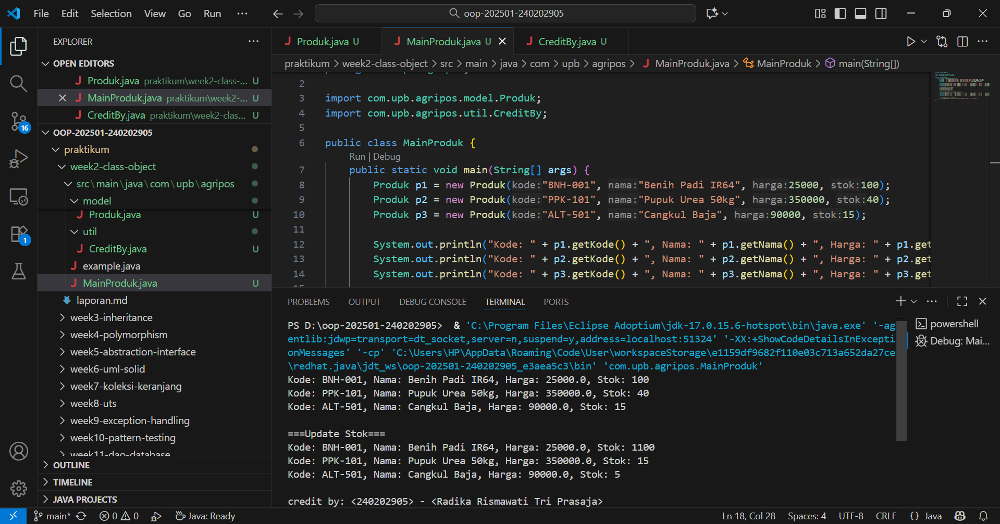

# Laporan Praktikum Minggu 2 
Topik: Class dan Object (Produk Pertanian)

## Identitas
- Nama  : Radika Rismawati Tri Prasaja
- NIM   : 240202905
- Kelas : 3IKRB

---

## Tujuan
1. Mahasiswa mampu menjelaskan konsep class, object, atribut, dan method dalam OOP.
2. Mahasiswa mampu menerapkan access modifier dan enkapsulasi dalam pembuatan class.
3. Mahasiswa mampu mengimplementasikan class Produk pertanian dengan atribut dan method yang sesuai.
4. Mahasiswa mampu mendemonstrasikan instansiasi object serta menampilkan data produk pertanian di  console.
5. Mahasiswa mampu menyusun laporan praktikum dengan bukti kode, hasil eksekusi, dan analisis sederhana.

---

## Dasar Teori
Class adalah blueprint atau cetak biru dari sebuah objek. Objek merupakan instansiasi dari class yang berisi atribut (data) dan method (perilaku). Dalam OOP, enkapsulasi dilakukan dengan menyembunyikan data menggunakan access modifier (public, private, protected) serta menyediakan akses melalui getter dan setter.

Dalam konteks Agri-POS, produk pertanian seperti benih, pupuk, dan alat pertanian dapat direpresentasikan sebagai objek yang memiliki atribut nama, harga, dan stok. Dengan menggunakan class, setiap produk dapat dibuat, dikelola, dan dimanipulasi secara lebih terstruktur.

---

## Langkah Praktikum
1. Membuat Class Produk
   a. Buat file Produk.java pada package model.
   b. Tambahkan atribut: kode, nama, harga, dan stok.
   c. Gunakan enkapsulasi dengan menjadikan atribut   bersifat private dan membuat getter serta setter untuk masing-masing atribut.

2. Membuat Class CreditBy
   a. Buat file CreditBy.java pada package util.
   b. Isi class dengan method statis untuk menampilkan identitas mahasiswa di akhir output: credit by: <NIM> - <Nama>.

3. Membuat Objek Produk dan Menampilkan Credit
   a. Buat file MainProduk.java.
   b. Instansiasi minimal tiga objek produk, misalnya "Benih Padi", "Pupuk Urea", dan satu produk alat pertanian.
   c Tampilkan informasi produk melalui method getter.
   d. Panggil CreditBy.print("<NIM>", "<Nama>") di akhir main untuk menampilkan identitas.

4. Commit dan Push
   a. Commit dengan pesan: week2-class-object.

---

## Kode Program

1. Produk.java 
```
package com.upb.agripos.model;

public class Produk {
    private String kode;
    private String nama;
    private double harga;
    private int stok;

    public Produk(String kode, String nama, double harga, int stok) {
        this.kode = kode;
        this.nama = nama;
        this.harga = harga;
        this.stok = stok;
    }

    public String getKode() { return kode; }
    public void setKode(String kode) { this.kode = kode; }

    public String getNama() { return nama; }
    public void setNama(String nama) { this.nama = nama; }

    public double getHarga() { return harga; }
    public void setHarga(double harga) { this.harga = harga; }

    public int getStok() { return stok; }
    public void setStok(int stok) { this.stok = stok; }

    public void tambahStok(int jumlah) {
        this.stok += jumlah;
    }

    public void kurangiStok(int jumlah) {
        if (this.stok >= jumlah) {
            this.stok -= jumlah;
        } else {
            System.out.println("Stok tidak mencukupi!");
        }
    }
}
```
2. CreditBy.java
```
package com.upb.agripos.util;

public class CreditBy {
    public static void print(String nim, String nama) {
        System.out.println("\ncredit by: " + nim + " - " + nama);
    }
}
```
3. MainProduk.java
```
package com.upb.agripos;

import com.upb.agripos.model.Produk;
import com.upb.agripos.util.CreditBy;

public class MainProduk {
    public static void main(String[] args) {
        Produk p1 = new Produk("BNH-001", "Benih Padi IR64", 25000, 100);
        Produk p2 = new Produk("PPK-101", "Pupuk Urea 50kg", 350000, 40);
        Produk p3 = new Produk("ALT-501", "Cangkul Baja", 90000, 15);

        System.out.println("Kode: " + p1.getKode() + ", Nama: " + p1.getNama() + ", Harga: " + p1.getHarga() + ", Stok: " + p1.getStok());
        System.out.println("Kode: " + p2.getKode() + ", Nama: " + p2.getNama() + ", Harga: " + p2.getHarga() + ", Stok: " + p2.getStok());
        System.out.println("Kode: " + p3.getKode() + ", Nama: " + p3.getNama() + ", Harga: " + p3.getHarga() + ", Stok: " + p3.getStok());

        // Tampilkan identitas mahasiswa
        CreditBy.print("<NIM>", "<Nama Mahasiswa>");
    }
}
```
---

## Hasil Eksekusi
1. 
---

## Analisis
1. Jelaskan bagaimana kode berjalan!
   **Jawab:** Program dimulai dari method main() pada class MainProduk. JVM akan mengeksekusi baris-baris di dalamnya secara berurutan. Pertama, dibuat tiga objek Produk dengan memanggil constructor Produk(String, String, double, int) yang mengisi nilai atribut kode, nama, harga, dan stok.

    Setiap objek menyimpan data produk yang berbeda seperti “Benih Padi IR64”, “Pupuk Urea 50kg”, dan “Cangkul Baja”. Untuk menampilkan data produk ke layar, method getter (getKode(), getNama(), getHarga(), dan getStok()) digunakan karena atribut di dalam class bersifat private dan tidak bisa diakses langsung. Data yang diambil dari getter kemudian dicetak menggunakan System.out.println().

    Setelah semua data produk ditampilkan, program memanggil CreditBy.print() untuk menampilkan identitas mahasiswa yang mengerjakan program. Method ini bersifat statis sehingga bisa dipanggil langsung tanpa membuat objek CreditBy.

    Selama proses eksekusi, JVM mengalokasikan memori untuk masing-masing objek Produk, menjalankan method getter, mencetak output ke console, lalu menutup program setelah selesai menampilkan identitas.

    Hasil eksekusi yang tampil di terminal adalah:
    Kode: BNH-001, Nama: Benih Padi IR64, Harga: 25000.0, Stok: 100
    Kode: PPK-101, Nama: Pupuk Urea 50kg, Harga: 350000.0, Stok: 40
    Kode: ALT-501, Nama: Cangkul Baja, Harga: 90000.0, Stok: 15

    credit by: 240202905 - Radika Rismawati Tri Prasaja

2. Apa perbedaan pendekatan minggu ini dibanding minggu sebelumnya?
   **Jawab:** Pada praktikum minggu ke-2, program sudah menerapkan konsep Object-Oriented Programming (OOP) secara nyata dengan menggunakan beberapa class seperti Produk, CreditBy, dan MainProduk. Kelas Produk menyimpan atribut kode, nama, harga, dan stok secara private, lalu diakses melalui getter-setter untuk menjaga enkapsulasi. Objek-objek dibuat melalui konstruktor, dan terdapat method untuk menambah atau mengurangi stok. Kelas CreditBy menampilkan identitas mahasiswa, sedangkan MainProduk menjadi pusat eksekusi dengan membuat dan menampilkan data beberapa produk.

    Dibanding minggu pertama, pendekatan minggu ke-2 jauh lebih terstruktur dan berorientasi objek. Minggu 1 masih berfokus pada pengenalan tiga paradigma pemrograman — prosedural, OOP sederhana, dan fungsional — dengan contoh program singkat seperti “Hello World” tanpa class atau interaksi antarobjek. Minggu 2 sudah menggunakan multi-class, konstruktor, enkapsulasi, dan interaksi antarobjek dalam konteks sistem nyata (AgriPOS).

    Secara keseluruhan, minggu pertama menekankan konsep dasar dan perbedaan paradigma, sedangkan minggu kedua menekankan penerapan penuh prinsip OOP dalam program yang modular dan terorganisir.

3. Kendala yang dihadapi dan cara mengatasinya
    **Jawab:** Selama praktikum, beberapa kendala yang mungkin muncul antara lain kesalahan struktur package, kesalahan penulisan nama class, serta error karena atribut bersifat private namun diakses langsung tanpa menggunakan getter. Masalah tersebut dapat diatasi dengan memastikan struktur folder sesuai dengan deklarasi package, menggunakan konvensi penamaan class yang benar (huruf besar di awal), dan memanfaatkan getter serta setter agar sesuai prinsip enkapsulasi.

    Selain itu, pastikan ekstensi Java di Visual Studio Code sudah terinstal dengan benar agar proses kompilasi dan eksekusi berjalan lancar. Bila terjadi error seperti “Could not find or load main class”, solusinya adalah menyesuaikan lokasi file agar sesuai dengan path package di dalam project.
---

## Kesimpulan
Pada praktikum minggu ke-2 ini diterapkan konsep dasar Object-Oriented Programming (OOP) melalui pembuatan dan penggunaan class serta object. Class Produk dibuat sebagai blueprint yang merepresentasikan data produk pertanian dengan atribut kode, nama, harga, dan stok. Setiap atribut dijaga dengan enkapsulasi, diakses menggunakan getter dan setter agar data tetap aman dan terkontrol. Konstruktor digunakan untuk menginisialisasi nilai saat objek dibuat, sedangkan method seperti tambahStok() dan kurangiStok() berfungsi mengatur perubahan jumlah stok produk. Selain itu, penggunaan class CreditBy menunjukkan cara membuat method statis di class terpisah untuk menampilkan informasi tambahan.

Dari hasil implementasi, program mampu menampilkan data tiga produk berbeda secara terstruktur di konsol dan menunjukkan bagaimana tiap objek bekerja secara mandiri namun tetap saling terhubung dalam satu sistem. Praktikum ini memperlihatkan bahwa dengan OOP, kode menjadi lebih modular, mudah dipahami, serta efisien untuk pengembangan aplikasi lebih kompleks di tahap berikutnya.
---

## Quiz
1. Mengapa atribut sebaiknya dideklarasikan sebagai private dalam class?
**Jawaban:** Atribut sebaiknya dibuat private agar tidak bisa diakses atau diubah secara langsung dari luar class. Tujuannya adalah untuk melindungi data (data hiding) supaya nilai di dalam objek tetap konsisten dan tidak dimanipulasi sembarangan. Dengan cara ini, perubahan terhadap data hanya bisa dilakukan melalui method yang telah disediakan (getter dan setter), sehingga logika program tetap terkontrol dan aman.

2. Apa fungsi getter dan setter dalam enkapsulasi?
**Jawaban:** Getter dan setter berfungsi sebagai jembatan antara atribut private dan dunia luar class.
Getter digunakan untuk mengambil nilai dari atribut. Setter digunakan untuk mengubah nilai atribut dengan cara yang terkontrol (misalnya bisa ditambah validasi sebelum nilainya diubah).
Keduanya memastikan bahwa akses terhadap data tetap melalui mekanisme yang aman tanpa harus membuka atribut secara langsung.

3. Bagaimana cara class Produk mendukung pengembangan aplikasi POS yang lebih kompleks?
**Jawaban:** Class Produk menjadi pondasi dalam sistem POS (Point of Sale) karena sudah memiliki struktur data dan perilaku dasar produk. Dengan class ini, pengembang bisa dengan mudah menambahkan fitur lain seperti:
   a. perhitungan total harga transaksi,
   b. pengelolaan stok otomatis saat pembelian atau pengembalian,
   c. integrasi dengan database untuk menyimpan data produk,
   d. serta pembuatan laporan penjualan.

Struktur class Produk yang terenkapsulasi dan modular menjadikannya mudah diperluas (extendable) dan mudah diintegrasikan dengan fitur lain tanpa perlu mengubah kode dasarnya.
