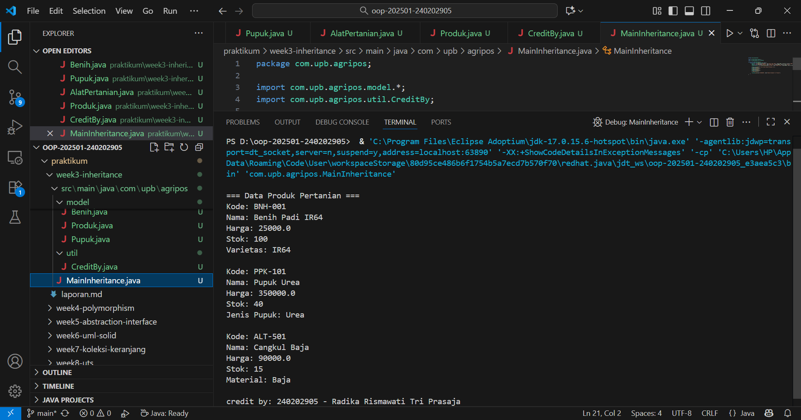

# Laporan Praktikum Minggu 3 
Topik: Inheritance (Kategori Produk)

## Identitas
- Nama  : Radika Rismawati Tri Prasaja 
- NIM   : 240202905
- Kelas : 3IKRB

---
## Tujuan
1. Mahasiswa mampu menjelaskan konsep inheritance (pewarisan class) dalam OOP.
2. Mahasiswa mampu membuat superclass dan subclass untuk produk pertanian.
3. Mahasiswa mampu mendemonstrasikan hierarki class melalui contoh kode.
4. Mahasiswa mampu menggunakan super untuk memanggil konstruktor dan method parent class.
5. Mahasiswa mampu membuat laporan praktikum yang menjelaskan perbedaan penggunaan inheritance dibanding class tunggal.
---

## Dasar Teori
Inheritance adalah mekanisme dalam OOP yang memungkinkan suatu class mewarisi atribut dan method dari class lain.

1. Superclass: class induk yang mendefinisikan atribut umum.
2. Subclass: class turunan yang mewarisi atribut/method superclass, dan dapat menambahkan atribut/method baru.

Super digunakan untuk memanggil konstruktor atau method superclass.
Dalam konteks Agri-POS, kita dapat membuat class Produk sebagai superclass, kemudian Benih, Pupuk, dan AlatPertanian sebagai subclass. Hal ini membuat kode lebih reusable dan terstruktur.
---

## Langkah Praktikum
1. Membuat Superclass Produk
   a. Gunakan class Produk dari Bab 2 sebagai superclass.

2. Membuat Subclass
   a. Benih.java → atribut tambahan: varietas.
   b. Pupuk.java → atribut tambahan: jenis pupuk (Urea, NPK, dll).
   c. AlatPertanian.java → atribut tambahan: material (baja, kayu, plastik).

3. Membuat Main Class
   a. Instansiasi minimal satu objek dari tiap subclass.
   b. Tampilkan data produk dengan memanfaatkan inheritance.

4. Menambahkan CreditBy
   a. Panggil class CreditBy untuk menampilkan identitas mahasiswa.

5. Commit dan Push
   b. Commit dengan pesan: week3-inheritance.
---

## Kode Program
1. Benih.java
```
package com.upb.agripos.model;

public class Benih extends Produk {
    private String varietas;

    public Benih(String kode, String nama, double harga, int stok, String varietas) {
        super(kode, nama, harga, stok);
        this.varietas = varietas;
    }

    public String getVarietas() { return varietas; }
    public void setVarietas(String varietas) { this.varietas = varietas; }

    @Override
    public void tampilkanInfo() {
        super.tampilkanInfo(); // tampilkan info dari Produk
        System.out.println("Varietas: " + varietas);
}
}
```
2. Pupuk.java
```
package com.upb.agripos.model;

public class Pupuk extends Produk {
    private String jenis;

    public Pupuk(String kode, String nama, double harga, int stok, String jenis) {
        super(kode, nama, harga, stok);
        this.jenis = jenis;
    }

    public String getJenis() { return jenis; }
    public void setJenis(String jenis) { this.jenis = jenis; }

    @Override
    public void tampilkanInfo() {
        super.tampilkanInfo();
        System.out.println("Jenis Pupuk: " + jenis);
}
}
```
3. AlatPertanian.java
```
package com.upb.agripos.model;

public class AlatPertanian extends Produk {
    private String material;

    public AlatPertanian(String kode, String nama, double harga, int stok, String material) {
        super(kode, nama, harga, stok);
        this.material = material;
    }

    public String getMaterial() { return material; }
    public void setMaterial(String material) { this.material = material; }

    @Override
    public void tampilkanInfo() {
        super.tampilkanInfo();
        System.out.println("Material: " + material);
}
}
```
4. MainInheritance.java
```
package com.upb.agripos;

import com.upb.agripos.model.*;
import com.upb.agripos.util.CreditBy;

public class MainInheritance {
    public static void main(String[] args) {
        Benih b = new Benih("BNH-001", "Benih Padi IR64", 25000, 100, "IR64");
        Pupuk p = new Pupuk("PPK-101", "Pupuk Urea", 350000, 40, "Urea");
        AlatPertanian a = new AlatPertanian("ALT-501", "Cangkul Baja", 90000, 15, "Baja");

        System.out.println("\n=== Data Produk Pertanian ===");
        b.tampilkanInfo();
        System.out.println();
        p.tampilkanInfo();
        System.out.println();
        a.tampilkanInfo();

        CreditBy.print("240202905", "Radika Rismawati Tri Prasaja");
    }
}
```
---

## Hasil Eksekusi
1. 
---

## Analisis
1. Jelaskan bagaimana kode berjalan! 
   **Jawab:** Program ini berjalan dengan menerapkan konsep inheritance (pewarisan class) dalam pemrograman berorientasi objek. Class Produk berfungsi sebagai superclass yang menyimpan atribut umum untuk semua produk pertanian seperti kode, nama, harga, dan stok. Dari class tersebut diturunkan tiga subclass, yaitu Benih, Pupuk, dan AlatPertanian, yang masing-masing menambahkan atribut khusus: Benih memiliki atribut varietas, Pupuk memiliki atribut jenis, dan AlatPertanian memiliki atribut material. Setiap subclass menggunakan keyword extends untuk mewarisi atribut dan method dari superclass serta memanggil konstruktor induk dengan super() agar data dasar produk dapat diinisialisasi.

   Selain itu, masing-masing subclass melakukan override terhadap method tampilkanInfo() untuk menampilkan informasi tambahan sesuai dengan jenis produknya. Ketika method tersebut dipanggil, program pertama menjalankan super.tampilkanInfo() untuk menampilkan atribut umum dari class Produk, lalu menampilkan atribut tambahan milik subclass. Pada class MainInheritance, dibuat tiga objek dari setiap subclass dan masing-masing memanggil method tampilkanInfo() untuk menampilkan data produk pertanian. Setelah semua informasi tampil di layar, class CreditBy digunakan untuk mencetak identitas pembuat program berupa NIM dan nama mahasiswa. Secara keseluruhan, program ini menunjukkan bagaimana pewarisan class membuat kode menjadi lebih efisien, terstruktur, dan mudah dikembangkan.

2. Apa perbedaan pendekatan minggu ini dibanding minggu sebelumnya?  
   **Jawab:** Perbedaan utama antara praktikum minggu ke-3 dan minggu ke-2 terletak pada pendekatan pemrograman yang digunakan dalam membangun struktur class. Pada minggu ke-2, fokus utama praktikum adalah pada pengenalan konsep dasar class dan object, di mana setiap class berdiri sendiri tanpa adanya hubungan hierarki. Class Produk dibuat sebagai class tunggal yang berisi atribut dan method untuk merepresentasikan produk pertanian secara umum. Semua data dan perilaku disatukan dalam satu class, sehingga meskipun sederhana dan mudah dipahami, pendekatan ini kurang fleksibel ketika sistem berkembang dan memerlukan variasi jenis produk yang lebih banyak.

   Sedangkan pada minggu ke-3, pendekatannya sudah lebih berorientasi pada konsep inheritance (pewarisan). Class Produk dari minggu sebelumnya dijadikan sebagai superclass yang menyimpan atribut dan method umum, kemudian dibuat beberapa subclass seperti Benih, Pupuk, dan AlatPertanian yang mewarisi struktur dasar dari Produk sekaligus menambahkan atribut khusus masing-masing. Dengan demikian, kode menjadi lebih terorganisir, reusable, dan mudah dikembangkan tanpa harus menulis ulang atribut dan method yang sama. Pendekatan inheritance ini menunjukkan bagaimana hubungan antar class dapat membentuk hierarki dan bagaimana penggunaan keyword super memungkinkan subclass untuk memanfaatkan konstruktor maupun method dari superclass. Jadi, jika minggu ke-2 berfokus pada pembuatan satu class mandiri, maka minggu ke-3 menekankan pada hubungan antarclass dan konsep pewarisan yang membuat program lebih modular dan efisien.
      
3. Kendala yang dihadapi dan cara mengatasinya
   **Jawab:** Selama proses pengerjaan, terdapat beberapa kendala yang sempat muncul. Awalnya, program tidak menampilkan output dengan lengkap karena method tampilkanInfo() belum dioverride di subclass, sehingga hanya atribut dari superclass yang tercetak. Masalah ini diselesaikan dengan menambahkan anotasi @Override serta pemanggilan super.tampilkanInfo() agar data induk juga ikut tampil. Selain itu, error cannot find symbol juga sempat muncul karena import package belum ditambahkan. Solusinya adalah menuliskan perintah import com.upb.agripos.model.*; dan import com.upb.agripos.util.CreditBy; pada bagian atas file MainInheritance.java. Tata letak output yang semula kurang rapi juga diperbaiki dengan menambahkan baris kosong menggunakan System.out.println(); di antara pemanggilan objek. Setelah semua perbaikan dilakukan, program berhasil dijalankan dengan benar dan menampilkan hasil sesuai harapan.
---

## Kesimpulan
Berdasarkan hasil praktikum minggu ke-3 dengan topik Inheritance (Kategori Produk), dapat disimpulkan bahwa konsep inheritance dalam pemrograman berorientasi objek memungkinkan suatu class untuk mewarisi atribut dan method dari class lain, sehingga kode menjadi lebih efisien, mudah dikelola, dan terstruktur. Dalam program ini, class Produk berperan sebagai superclass yang menyimpan atribut umum seperti kode, nama, harga, dan stok, sedangkan class Benih, Pupuk, dan AlatPertanian berperan sebagai subclass yang menambahkan atribut khusus sesuai jenis produknya.

Dengan penerapan pewarisan, setiap subclass dapat menggunakan konstruktor dan method dari superclass menggunakan keyword super, serta melakukan override pada method tampilkanInfo() untuk menampilkan data tambahan masing-masing produk. Hasil output menunjukkan bahwa ketiga subclass berhasil menampilkan informasi produk secara lengkap berdasarkan hierarki yang telah dibuat. Secara keseluruhan, penerapan inheritance membuat program lebih modular, meminimalisir duplikasi kode, serta memperlihatkan hubungan “is-a” antar objek dalam sistem produk pertanian.
---

## Quiz
1. Apa keuntungan menggunakan inheritance dibanding membuat class terpisah tanpa hubungan?
   **Jawaban:** Keuntungan menggunakan inheritance adalah dapat menghindari penulisan kode yang berulang karena subclass dapat mewarisi atribut dan method dari superclass. Hal ini membuat program lebih efisien, mudah dikelola, serta memudahkan pengembangan dan pemeliharaan karena perubahan pada superclass otomatis berpengaruh pada subclass yang terkait.

2. Bagaimana cara subclass memanggil konstruktor superclass?
   **Jawaban:** Subclass dapat memanggil konstruktor superclass menggunakan keyword super(). Keyword ini digunakan di dalam konstruktor subclass untuk menginisialisasi atribut yang dimiliki oleh superclass agar data dari kelas induk bisa langsung digunakan oleh kelas turunan.

3. Berikan contoh kasus di POS pertanian selain Benih, Pupuk, dan Alat Pertanian yang bisa dijadikan subclass.
   **Jawaban:** Contoh lain yang bisa dijadikan subclass pada sistem POS pertanian adalah Pestisida dan Obat Tanaman. Keduanya masih termasuk produk pertanian dengan atribut yang mirip seperti nama produk, harga, dan stok, namun memiliki karakteristik tambahan seperti jenis bahan kimia atau tanggal kedaluwarsa.
