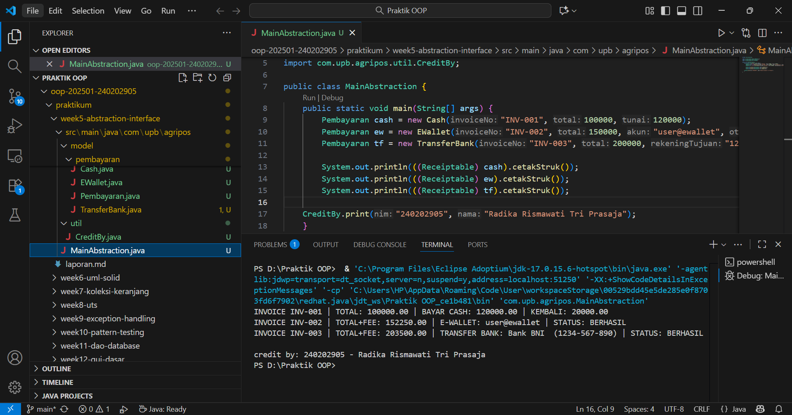

# Laporan Praktikum Minggu 5
Topik: Abstraction (Abstract Class & Interface)

## Identitas
- Nama  : Radika Rismawati Tri Prasaja
- NIM   : 240202905
- Kelas : 3IKRB

---

## Tujuan
1. Mahasiswa mampu menjelaskan perbedaan abstract class dan interface.
2. Mahasiswa mampu mendesain abstract class dengan method abstrak sesuai kebutuhan kasus.
3. Mahasiswa mampu membuat interface dan mengimplementasikannya pada class.
4. Mahasiswa mampu menerapkan multiple inheritance melalui interface pada rancangan kelas.
5. Mahasiswa mampu mendokumentasikan kode (komentar kelas/method, README singkat pada folder minggu).
---

## Dasar Teori
Abstraksi adalah proses menyederhanakan kompleksitas dengan menampilkan elemen penting dan menyembunyikan detail implementasi.

1. Abstract class: tidak dapat diinstansiasi, dapat memiliki method abstrak (tanpa badan) dan non-abstrak. Dapat menyimpan state (field).
2. Interface: kumpulan kontrak (method tanpa implementasi konkret). Sejak Java 8 mendukung default method. Mendukung multiple inheritance (class dapat mengimplementasikan banyak interface).
3. Gunakan abstract class bila ada shared state dan perilaku dasar; gunakan interface untuk mendefinisikan kemampuan/kontrak lintas hierarki.

Dalam konteks Agri-POS, Pembayaran dapat dimodelkan sebagai abstract class dengan method abstrak prosesPembayaran() dan biaya(). Implementasi konkritnya: Cash dan EWallet. Kemudian, interface seperti Validatable (mis. verifikasi OTP) dan Receiptable (mencetak bukti) dapat diimplementasikan oleh jenis pembayaran yang relevan.
---

## Langkah Praktikum
1. Abstract Class – Pembayaran

   a. Buat Pembayaran (abstract) dengan field invoiceNo, total dan method:
      1. double biaya() (abstrak) → biaya tambahan (fee).
      2. boolean prosesPembayaran() (abstrak) → mengembalikan status berhasil/gagal.
      3. double totalBayar() (konkrit) → return total + biaya();.

2. Subclass Konkret

   a. Cash → biaya = 0, proses = selalu berhasil jika tunai >= totalBayar().
   b. EWallet → biaya = 1.5% dari total; proses = membutuhkan validasi.
   
3. Interface

   a. Validatable → boolean validasi(); (contoh: OTP).
   b. Receiptable → String cetakStruk();

4. Multiple Inheritance via Interface

   a. EWallet mengimplementasikan dua interface: Validatable, Receiptable.
   b. Cash setidaknya mengimplementasikan Receiptable.

5. Main Class

   a. Buat MainAbstraction.java untuk mendemonstrasikan pemakaian Pembayaran (polimorfik).
   b. Tampilkan hasil proses dan struk. Di akhir, panggil CreditBy.print("[NIM]", "[Nama]").

6. Commit dan Push

   a. Commit dengan pesan: week5-abstraction-interface.
---

## Kode Program
1. Cash.java
```
package com.upb.agripos.model.pembayaran;

import com.upb.agripos.model.kontrak.Receiptable;

public class Cash extends Pembayaran implements Receiptable {
    private double tunai;

    public Cash(String invoiceNo, double total, double tunai) {
        super(invoiceNo, total);
        this.tunai = tunai;
    }

    @Override
    public double biaya() {
        return 0.0;
    }

    @Override
    public boolean prosesPembayaran() {
        return tunai >= totalBayar(); // sederhana: cukup uang tunai
    }

    @Override
    public String cetakStruk() {
        return String.format("INVOICE %s | TOTAL: %.2f | BAYAR CASH: %.2f | KEMBALI: %.2f",
                invoiceNo, totalBayar(), tunai, Math.max(0, tunai - totalBayar()));
    }
}
```
2. 
```
package com.upb.agripos.model.pembayaran;

import com.upb.agripos.model.kontrak.Validatable;
import com.upb.agripos.model.kontrak.Receiptable;

public class EWallet extends Pembayaran implements Validatable, Receiptable {
    private String akun;
    private String otp; // sederhana untuk simulasi

    public EWallet(String invoiceNo, double total, String akun, String otp) {
        super(invoiceNo, total);
        this.akun = akun;
        this.otp = otp;
    }

    @Override
    public double biaya() {
        return total * 0.015; // 1.5% fee
    }

    @Override
    public boolean validasi() {
        return otp != null && otp.length() == 6; // contoh validasi sederhana
    }

    @Override
    public boolean prosesPembayaran() {
        return validasi(); // jika validasi lolos, anggap berhasil
    }

    @Override
    public String cetakStruk() {
        return String.format("INVOICE %s | TOTAL+FEE: %.2f | E-WALLET: %s | STATUS: %s",
                invoiceNo, totalBayar(), akun, prosesPembayaran() ? "BERHASIL" : "GAGAL");
    }
}
```
3. Pembayaran.java
```
package com.upb.agripos.model.pembayaran;

public abstract class Pembayaran {
    protected String invoiceNo;
    protected double total;

    public Pembayaran(String invoiceNo, double total) {
        this.invoiceNo = invoiceNo;
        this.total = total;
    }

    public abstract double biaya();               // fee/biaya tambahan
    public abstract boolean prosesPembayaran();   // proses spesifik tiap metode

    public double totalBayar() {
        return total + biaya();
    }

    public String getInvoiceNo() { return invoiceNo; }
    public double getTotal() { return total; }
}
```
4. TransferBank.java
```
package com.upb.agripos.model.pembayaran;


import com.upb.agripos.model.kontrak.Validatable;
import com.upb.agripos.model.pembayaran.Pembayaran;
import com.upb.agripos.model.kontrak.Receiptable;

public class TransferBank extends Pembayaran implements Validatable, Receiptable {
    private String rekeningTujuan;
    private String token; // kode keamanan 8 digit

    public TransferBank(String invoiceNo, double total, String rekeningTujuan, String token) {
        super(invoiceNo, total);
        this.rekeningTujuan = rekeningTujuan;
        this.token = token;
    }

    @Override
    public double biaya() {
        return 3500; // biaya tetap transfer bank
    }

    @Override
    public boolean validasi() {
        return token != null && token.length() == 8; // token harus 8 digit
    }

    @Override
    public boolean prosesPembayaran() {
        return validasi();
    }

    @Override
    public String cetakStruk() {
        return String.format("INVOICE %s | TOTAL+FEE: %.2f | TRANSFER BANK: Bank BNI  (%s) | STATUS: %s",
                invoiceNo, totalBayar(), rekeningTujuan,
                prosesPembayaran() ? "BERHASIL" : "GAGAL");
    }
}
```
5. Receiptable.java
```
package com.upb.agripos.model.kontrak;

public interface Receiptable {
    String cetakStruk();
}
```
6. Validatable.java
```
package com.upb.agripos.model.kontrak;

public interface Validatable {
    boolean validasi(); // misal validasi OTP/ PIN
}
```
7. CreditBy.java
```
package com.upb.agripos.util;

public class CreditBy {
    public static void print(String nim, String nama) {
        System.out.println("\ncredit by: " + nim + " - " + nama);
    }
}
```
8. MainAbstraction.java
```
package com.upb.agripos;

import com.upb.agripos.model.pembayaran.*;
import com.upb.agripos.model.kontrak.*;
import com.upb.agripos.util.CreditBy;

public class MainAbstraction {
    public static void main(String[] args) {
        Pembayaran cash = new Cash("INV-001", 100000, 120000);
        Pembayaran ew = new EWallet("INV-002", 150000, "user@ewallet", "123456");
        Pembayaran tf = new TransferBank("INV-003", 200000, "1234-567-890", "87654321");

        System.out.println(((Receiptable) cash).cetakStruk());
        System.out.println(((Receiptable) ew).cetakStruk());
        System.out.println(((Receiptable) tf).cetakStruk());
        
    CreditBy.print("240202905", "Radika Rismawati Tri Prasaja");
    }
}
```
---

## Hasil Eksekusi
1. 
---

## Analisis

1. Jelaskan bagaimana kode berjalan!
   Jawab: Program dimulai dari kelas MainAbstraction, di mana tiga objek pembayaran dibuat secara polimorfik menggunakan referensi bertipe Pembayaran: Cash, EWallet, dan TransferBank. Karena Pembayaran adalah abstract class, objek konkretnya adalah subclass yang mengimplementasikan method abstrak biaya() dan prosesPembayaran(). Setiap objek juga mengimplementasikan interface yang sesuai. Cash hanya mengimplementasikan Receiptable, sedangkan EWallet dan TransferBank mengimplementasikan dua interface sekaligus, yaitu Validatable dan Receiptable, sehingga mendemonstrasikan multiple inheritance melalui interface. Saat program berjalan, tiap objek dipanggil method cetakStruk() setelah dilakukan casting ke Receiptable. Method ini secara internal memanggil totalBayar(), yaitu total harga ditambah biaya tambahan berdasarkan implementasi masing-masing. Untuk Cash, biaya = 0 sehingga pembayaran dianggap berhasil jika uang tunai mencukupi. Pada EWallet, biaya() sebesar 1.5% dan prosesPembayaran() akan berhasil hanya jika OTP valid (6 digit). Sedangkan TransferBank menerapkan biaya tetap 3500 dan proses berhasil bila token 8 digit valid. Seluruh output struk dicetak, lalu program menampilkan credit menggunakan CreditBy.print().

2. Apa perbedaan pendekatan minggu ini dibanding minggu sebelumnya?
   Jawab: Pada minggu sebelumnya fokus pembelajaran berada pada inheritance dan polymorphism, yaitu bagaimana suatu class dapat mewarisi atribut dan method dari class lain serta bagaimana objek-objek dengan tipe berbeda dapat diperlakukan secara seragam. Pendekatannya masih berpusat pada hubungan hierarki antar-class dan pewarisan perilaku yang sudah ada.
   
   Sedangkan pada minggu ini pendekatan bergeser ke tingkat abstraksi yang lebih tinggi melalui abstraction, yaitu penggunaan abstract class dan interface untuk mendefinisikan kerangka perilaku tanpa memberikan implementasi lengkap. Pendekatan ini mendorong desain sistem yang lebih fleksibel dan modular, karena class-class tidak harus berada dalam satu hierarki untuk berbagi kemampuan tertentu (melalui interface), dan class abstrak dapat menyediakan template dasar yang wajib diikuti oleh turunannya.
   Dengan demikian, perbedaan utama minggu ini adalah penekanan pada penyembunyian detail implementasi, penentuan kontrak perilaku, serta pemisahan antara apa yang harus dilakukan dan bagaimana cara melakukannya, bukan sekadar pewarisan struktur seperti pada minggu sebelumnya.

3. Kendala yang dihadapi dan cara mengatasinya
   Jawab: Kendala yang sering muncul adalah error terkait struktur package, salah penamaan interface (misalnya salah ketik “Validitable” vs “Validatable”), serta kegagalan casting jika class tidak mengimplementasikan interface yang ingin dipanggil. Selain itu, error dapat terjadi jika file tidak berada di folder sesuai struktur package Java atau terjadi mismatch nama file dan nama class. Cara mengatasinya adalah memastikan struktur folder mengikuti path package (com/upb/agripos/...), konsisten dalam penamaan interface/class, memastikan subclass benar-benar mengimplementasikan method yang diwajibkan oleh interface, melakukan build ulang project, serta mengecek kembali import setiap file agar tidak terjadi konflik dependency. Dengan penataan yang benar, seluruh kode dapat berjalan lancar dan menampilkan struk sesuai mekanisme abstraksi, interface, dan polimorfisme.

---

## Kesimpulan
Pada praktikum minggu ke-5 ini, konsep abstraction berhasil diterapkan melalui penggunaan abstract class dan interface dalam studi kasus sistem pembayaran Agri-POS. Abstract class digunakan untuk menyatukan struktur dasar dan perilaku umum pada kelas Pembayaran, sementara interface digunakan untuk mendefinisikan kemampuan tambahan seperti validasi dan pencetakan struk tanpa mengikat hierarki. Implementasi kelas Cash, EWallet, dan TransferBank menunjukkan bagaimana method abstrak di-override sesuai kebutuhan masing-masing, serta bagaimana multiple inheritance dapat dicapai melalui penerapan lebih dari satu interface dalam satu class. Melalui praktikum ini, mahasiswa memahami perbedaan, fungsi, dan penerapan abstraction dalam desain kelas yang lebih modular, fleksibel, dan mudah dikembangkan. Selain itu, program berhasil menunjukkan pemanfaatan polimorfisme saat objek-objek pembayaran diperlakukan sebagai tipe Pembayaran namun menjalankan perilaku spesifiknya masing-masing. Keseluruhan kegiatan memperkuat pemahaman mengenai desain OOP yang bersih, terstruktur, dan berorientasi kontrak.

---

## Quiz
1. Jelaskan perbedaan konsep dan penggunaan abstract class dan interface!
   **Jawaban:** Abstract class digunakan untuk menggambarkan kerangka dasar dari suatu kelompok objek yang memiliki kesamaan struktur dan perilaku. Di dalamnya dapat berisi field, constructor, method abstrak, serta method konkret. Class ini cocok dipakai ketika beberapa subclass berbagi state atau perilaku umum.

   Sementara itu, interface berisi kumpulan kontrak berupa method tanpa implementasi (kecuali default method). Interface tidak menyimpan state dan digunakan untuk mendefinisikan kemampuan tambahan yang dapat diterapkan lintas hierarki. Interface cocok digunakan ketika class berbeda-beda membutuhkan perilaku yang sama tetapi tidak memiliki hubungan pewarisan langsung.

2. Mengapa multiple inheritance lebih aman dilakukan dengan interface pada Java?
   **Jawaban:** Multiple inheritance dengan class berpotensi menimbulkan diamond problem, yaitu konflik pewarisan ketika dua superclass memiliki implementasi yang sama. Java menghindari masalah tersebut dengan tidak mengizinkan multiple inheritance pada class. Interface aman digunakan karena tidak membawa state dan hanya berisi kontrak, sehingga tidak ada konflik implementasi. Jika terdapat default method sekalipun, Java tetap memberikan mekanisme eksplisit untuk menentukan implementasi mana yang dipakai. Dengan demikian, interface memungkinkan fleksibilitas tanpa risiko benturan pewarisan.

3. Pada contoh Agri-POS, bagian mana yang paling tepat menjadi abstract class dan mana yang  menjadi interface? Jelaskan alasannya!
   **Jawaban:** Pada kasus Agri-POS, Pembayaran merupakan bagian yang paling tepat dijadikan abstract class karena semua metode pembayaran memiliki struktur dasar yang sama: nomor invoice, total transaksi, perhitungan biaya tambahan, dan proses pembayaran. Struktur ini memiliki state dan perilaku yang dapat diwariskan.

   Sementara itu, Validatable dan Receiptable paling tepat dibuat sebagai interface karena keduanya hanya mendefinisikan kemampuan tambahan: validasi (misalnya OTP atau token) dan pencetakan struk. Tidak semua metode pembayaran membutuhkan kemampuan yang sama, sehingga interface memberikan fleksibilitas. Dengan cara ini, class seperti EWallet dan TransferBank dapat mengimplementasikan beberapa interface sekaligus tanpa terikat hierarki tunggal.
