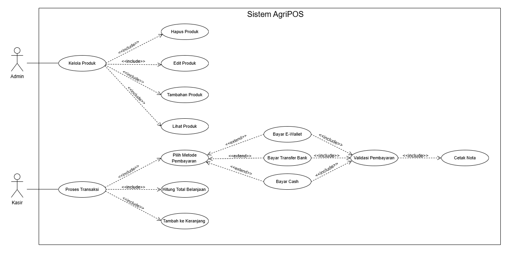
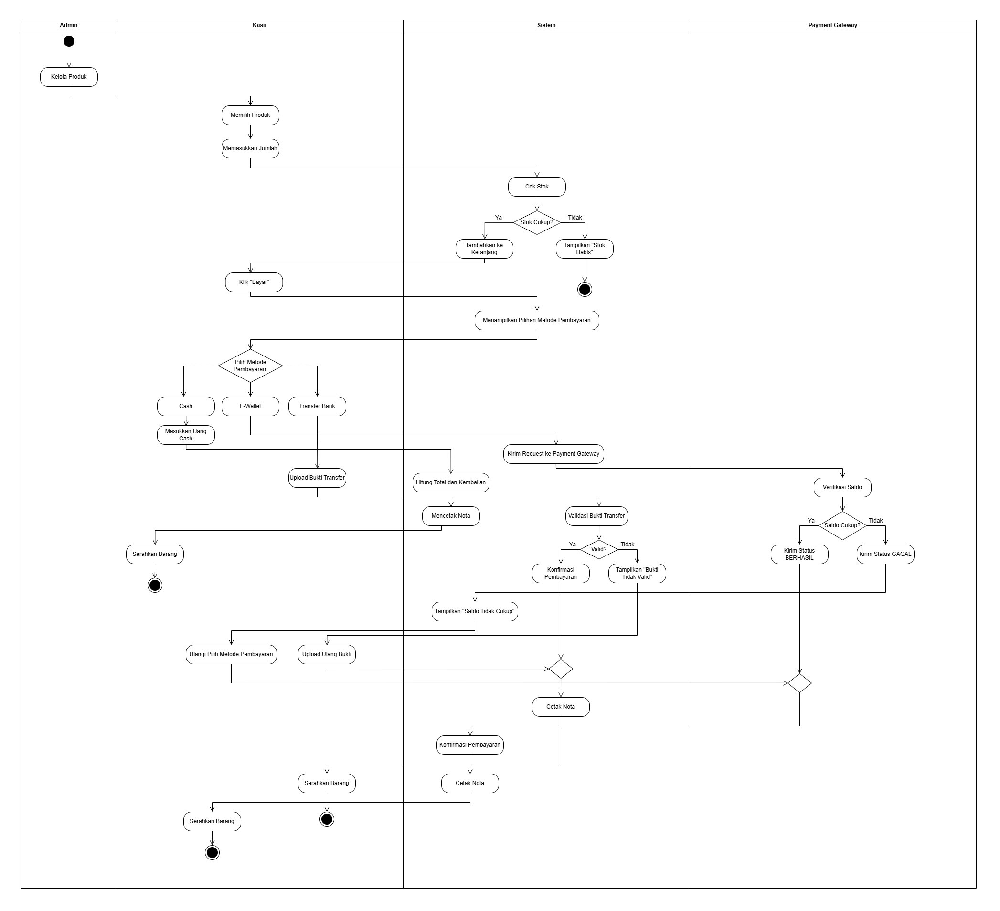
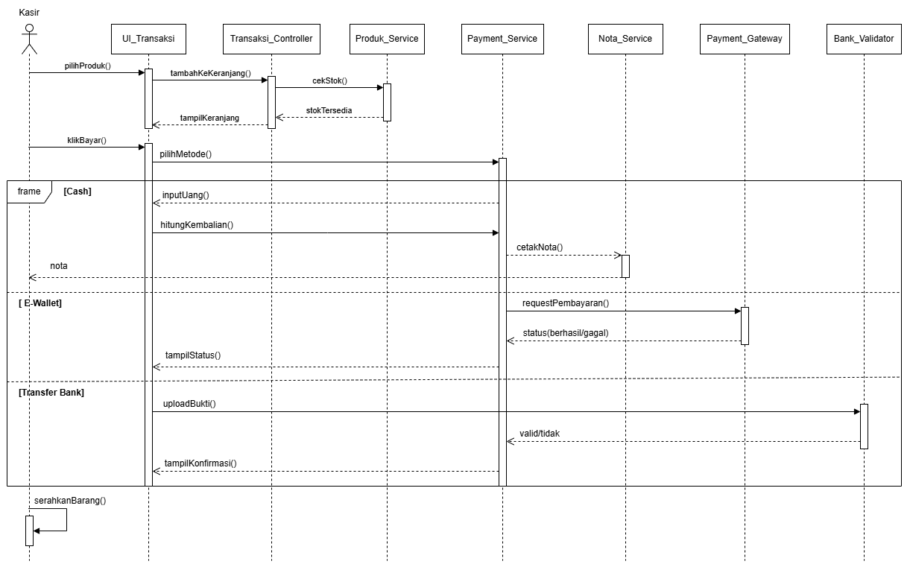
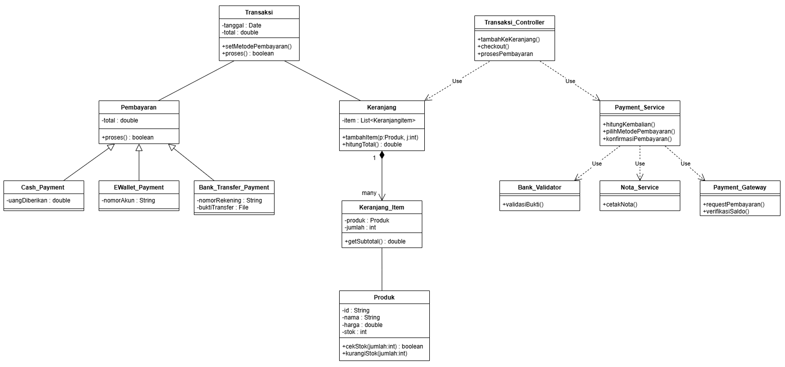

# Laporan Praktikum Minggu 6
Topik: Desain Arsitektur Sistem dengan UML dan Prinsip SOLID

## Identitas
- Nama  : Radika Rismawati Tri Prasaja
- NIM   : 240202905
- Kelas : 3IKRB

---

## Tujuan
1. Mahasiswa mampu mengidentifikasi kebutuhan sistem ke dalam diagram UML.
2. Mahasiswa mampu menggambar UML Class Diagram dengan relasi antar class yang tepat.
3. Mahasiswa mampu menjelaskan prinsip desain OOP (SOLID).
4. Mahasiswa mampu menerapkan minimal dua prinsip SOLID dalam kode program.
---

## Deskripsi Sistem Agri-POS
AgriPOS merupakan sistem Point of Sale untuk penjualan produk pertanian seperti pupuk, benih, dan alat pertanian. Sistem ini digunakan untuk membantu proses transaksi penjualan di toko pertanian.

Aktor dalam Sistem

* Admin : Bertanggung jawab mengelola data produk.
* Kasir : Bertanggung jawab melakukan proses transaksi dan pembayaran.

Kebutuhan Fungsional (Functional Requirements)

Berdasarkan diagram UML yang dibuat, kebutuhan fungsional sistem Agri-POS meliputi:

1. Manajemen Produk  
2. Transaksi Penjualan 
3. Metode Pembayaran Sistem (Tunai dan E-Wallet)
4. Pencetakan Struk dan Laporan 
5. Login dan Hak Akses 
---

## Desain UML Sistem
Perancangan sistem Agri-POS direpresentasikan menggunakan empat diagram UML utama sebagai berikut: 

### 1. Use Case Diagram
Use Case Diagram menggambarkan interaksi antara aktor dengan sistem.

**Aktor**:
  - Admin
  - Kasir
**Use Case Utama**:
  - Login
  - Kelola Produk
  - Proses Checkout
  - Pembayaran
  - Cetak Struk

Relasi **include** dan **extend** digunakan untuk menunjukkan keterkaitan antar use case, khususnya pada proses checkout dan pembayaran.

### 2.  Activity Diagram – Proses Checkout
Activity Diagram menggambarkan alur aktivitas saat proses checkout berlangsung.

Menggunakan **swimlane**:
  - Kasir
  - Sistem
  - Payment Gateway
Terdapat **decision node** untuk:
  - Pengecekan ketersediaan stok
  - Keberhasilan atau kegagalan pembayaran

Diagram ini menunjukkan alur normal dan alur gagal pada proses transaksi.

### 3. Sequence Diagram – Proses Pembayaran

Sequence Diagram menunjukkan interaksi antar objek secara berurutan saat proses pembayaran.

- Kasir berinteraksi dengan `TransaksiController`
- Sistem mengelola keranjang, transaksi, dan pembayaran
- Menggunakan **alt fragment** untuk membedakan:
  - Pembayaran Tunai
  - Pembayaran E-Wallet

Diagram ini memperjelas urutan pemanggilan method pada sistem.

### 4. Class Diagram

Class Diagram menggambarkan struktur statis sistem Agri-POS.

Kelas utama:
  - Produk
  - Keranjang
  - KeranjangItem
  - Transaksi
  - Pembayaran
  - Cash
  - EWallet
  - TransaksiController
Relasi yang digunakan:
  - Association
  - Composition
  - Inheritance
  - Dependency

Visibility (`+`, `-`, `#`) digunakan untuk menunjukkan akses atribut dan method.

---

## Penerapan Prinsip SOLID

Penerapan prinsip SOLID pada desain sistem Agri-POS adalah sebagai berikut:

### 1. Single Responsibility Principle (SRP)
Setiap kelas memiliki satu tanggung jawab utama.
- `Produk` menangani data produk.
- `Keranjang` menangani item pembelian.
- `Transaksi` menangani data transaksi.

### 2. Open/Closed Principle (OCP)
Sistem terbuka untuk penambahan metode pembayaran baru tanpa mengubah kode yang sudah ada.
- Penambahan metode pembayaran dapat dilakukan dengan menurunkan kelas `Pembayaran`.

### 3. Liskov Substitution Principle (LSP)
Subclass seperti `Cash` dan `EWallet` dapat menggantikan kelas induk `Pembayaran` tanpa mengganggu sistem.

### 4. Interface Segregation Principle (ISP)
Antarmuka pembayaran dibuat spesifik sesuai kebutuhan sistem transaksi.

### 5. Dependency Inversion Principle (DIP)
Controller bergantung pada abstraksi (`Pembayaran`), bukan pada implementasi konkret (`Cash` atau `EWallet`).
---

## Traceability Matrix (FR ke Diagram)

| Kebutuhan Fungsional | Use Case | Activity | Sequence | Class |
|---------------------|----------|----------|----------|-------|
| Login pengguna | Login | - | - | User |
| Kelola produk | Kelola Produk | - | - | Produk |
| Pilih produk | Checkout | Checkout | Checkout | Keranjang |
| Validasi stok | Checkout | Checkout | Checkout | Produk |
| Proses pembayaran | Pembayaran | Checkout | Pembayaran | Pembayaran |
| Cetak struk | Cetak Struk | Checkout | Pembayaran | Transaksi |
---

## Kesimpulan

Berdasarkan perancangan UML dan analisis prinsip SOLID, sistem Agri-POS telah dirancang secara terstruktur dan konsisten antar diagram. Desain ini mampu merepresentasikan kebutuhan fungsional sistem dengan jelas serta mendukung pengembangan sistem yang fleksibel, mudah dipelihara, dan dapat dikembangkan di masa mendatang.
---

## Quiz
1. Jelaskan perbedaan aggregation dan composition serta berikan contoh penerapannya pada desain Anda.
   **Jawaban:** 
Aggregation
Hubungan lemah, objek masih bisa berdiri sendiri.
Contoh: KeranjangItem → Produk.

Composition
Hubungan kuat, objek bergantung pada induknya.
Contoh: Keranjang ─ KeranjangItem.

2.  Bagaimana prinsip Open/Closed dapat memastikan sistem mudah dikembangkan?
   **Jawaban:** Dengan OCP, sistem AgriPOS dapat dikembangkan dengan mudah.
Contohnya, jika ingin menambahkan metode pembayaran baru (QRIS), cukup membuat class baru yang mewarisi Pembayaran tanpa mengubah class Transaksi.

3.  Mengapa Dependency Inversion Principle (DIP) meningkatkan testability?
   **Jawaban:** Karena kelas tingkat tinggi bergantung pada abstraksi:
* Transaksi bergantung pada Pembayaran, bukan Cash atau EWallet.
* Saat pengujian, dapat digunakan mock payment tanpa bergantung pada sistem pembayaran nyata.
