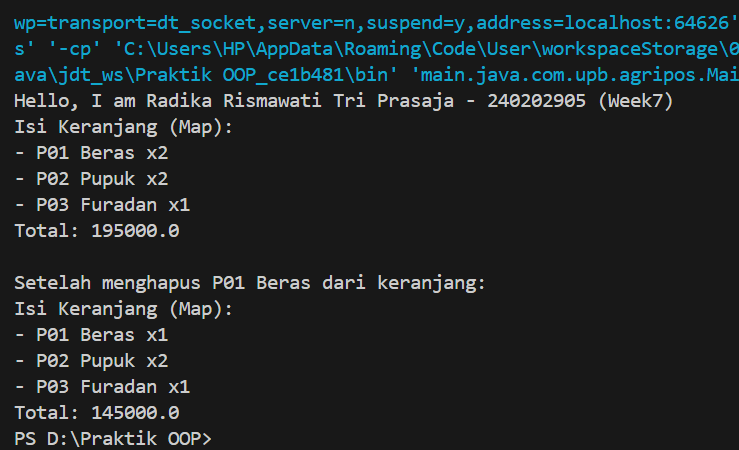

# Laporan Praktikum Minggu 7 
Topik: Collections dan Implementasi Keranjang Belanja

## Identitas
- Nama  : Radika Rismawati Tri Prasaja
- NIM   : 240202905
- Kelas : 3IKRB

---

## Tujuan
1. Menjelaskan konsep collection dalam Java (List, Map, Set).
2. Menggunakan ArrayList untuk menyimpan dan mengelola objek.
3. Mengimplementasikan Map atau Set sesuai kebutuhan pengelolaan data.
4. Melakukan operasi dasar pada collection: tambah, hapus, dan hitung total.
5. Menganalisis efisiensi penggunaan collection dalam konteks sistem Agri-POS.

---

## Dasar Teori
1. Collections Framework
Java Collections Framework menyediakan struktur data untuk mengelola objek secara dinamis dan efisien.

Struktur utama:

List (implementasi: ArrayList) — Terurut, dapat menyimpan elemen duplikat.
Map (implementasi: HashMap) — Menyimpan pasangan key–value, akses cepat berdasarkan key.
Set (implementasi: HashSet) — Tidak menerima duplikat dan tidak mempertahankan urutan.

2. Studi Kasus: Keranjang Belanja Agri-POS
Keranjang belanja harus dapat:

Menambahkan produk
Menghapus produk
Menampilkan isi keranjang
Menghitung total nilai transaksi
Menangani jumlah (quantity) menggunakan Map
Kasus ini mencerminkan penggunaan struktur data dalam aplikasi nyata seperti POS.

---

## Langkah Praktikum
1. Membuat Class Product
```
package com.upb.agripos;

public class Product {
    private final String code;
    private final String name;
    private final double price;

    public Product(String code, String name, double price) {
        this.code = code;
        this.name = name;
        this.price = price;
    }

    public String getCode() { return code; }
    public String getName() { return name; }
    public double getPrice() { return price; }
}
```
2. Implementasi Keranjang dengan ArrayList
```
package com.upb.agripos;

import java.util.ArrayList;

public class ShoppingCart {
    private final ArrayList<Product> items = new ArrayList<>();

    public void addProduct(Product p) { items.add(p); }
    public void removeProduct(Product p) { items.remove(p); }

    public double getTotal() {
        double sum = 0;
        for (Product p : items) {
            sum += p.getPrice();
        }
        return sum;
    }

    public void printCart() {
        System.out.println("Isi Keranjang:");
        for (Product p : items) {
            System.out.println("- " + p.getCode() + " " + p.getName() + " = " + p.getPrice());
        }
        System.out.println("Total: " + getTotal());
    }
}
```
3. Main Program (WAJIB DIISI)
```
package com.upb.agripos;

public class MainCart {
    public static void main(String[] args) {
        System.out.println("Hello, I am [Nama]-[NIM] (Week7)");

        Product p1 = new Product("P01", "Beras", 50000);
        Product p2 = new Product("P02", "Pupuk", 30000);

        ShoppingCart cart = new ShoppingCart();
        cart.addProduct(p1);
        cart.addProduct(p2);
        cart.printCart();

        cart.removeProduct(p1);
        cart.printCart();
    }
}
```
4. Implementasi Alternatif Menggunakan Map (Dengan Quantity)
```
package com.upb.agripos;

import java.util.HashMap;
import java.util.Map;

public class ShoppingCartMap {
    private final Map<Product, Integer> items = new HashMap<>();

    public void addProduct(Product p) { items.put(p, items.getOrDefault(p, 0) + 1); }

    public void removeProduct(Product p) {
        if (!items.containsKey(p)) return;
        int qty = items.get(p);
        if (qty > 1) items.put(p, qty - 1);
        else items.remove(p);
    }

    public double getTotal() {
        double total = 0;
        for (Map.Entry<Product, Integer> entry : items.entrySet()) {
            total += entry.getKey().getPrice() * entry.getValue();
        }
        return total;
    }

    public void printCart() {
        System.out.println("Isi Keranjang (Map):");
        for (Map.Entry<Product, Integer> e : items.entrySet()) {
            System.out.println("- " + e.getKey().getCode() + " " + e.getKey().getName() + " x" + e.getValue());
        }
        System.out.println("Total: " + getTotal());
    }
}
```

---

## Kode Program
1. Product.java
```
package main.java.com.upb.agripos;

public class Product {
    private final String code;
    private final String name;
    private final double price;

    public Product(String code, String name, double price) {
        this.code = code;
        this.name = name;
        this.price = price;
    }

    public String getCode() { return code; }
    public String getName() { return name; }
    public double getPrice() { return price; }
}
```
2. ShoppingCart.java
```
package main.java.com.upb.agripos;

import java.util.ArrayList;

public class ShoppingCart {
    private final ArrayList<Product> items = new ArrayList<>();

    public void addProduct(Product p) { items.add(p); }
    public void removeProduct(Product p) { items.remove(p); }

    public double getTotal() {
        double sum = 0;
        for (Product p : items) {
            sum += p.getPrice();
        }
        return sum;
    }

    public void printCart() {
        System.out.println("Isi Keranjang:");
        for (Product p : items) {
            System.out.println("- " + p.getCode() + " " + p.getName() + " = " + p.getPrice());
        }
        System.out.println("Total: " + getTotal());
    }
}
```
3. ShoppingCartMap.java
```
package main.java.com.upb.agripos;

import java.util.HashMap;
import java.util.Map;

public class ShoppingCartMap {
    private final Map<Product, Integer> items = new HashMap<>();

    public void addProduct(Product p) { items.put(p, items.getOrDefault(p, 0) + 1); }

    public void removeProduct(Product p) {
        if (!items.containsKey(p)) return;
        int qty = items.get(p);
        if (qty > 1) items.put(p, qty - 1);
        else items.remove(p);
    }

    public double getTotal() {
        double total = 0;
        for (Map.Entry<Product, Integer> entry : items.entrySet()) {
            total += entry.getKey().getPrice() * entry.getValue();
        }
        return total;
    }

    public void printCart() {
        System.out.println("Isi Keranjang (Map):");
        for (Map.Entry<Product, Integer> e : items.entrySet()) {
            System.out.println("- " + e.getKey().getCode() + " " + e.getKey().getName() + " x" + e.getValue());
        }
        System.out.println("Total: " + getTotal());
    }
}
```
4. MainCart.java
```
package main.java.com.upb.agripos;

public class MainCart {
    public static void main(String[] args) {
        System.out.println("Hello, I am Radika Rismawati Tri Prasaja - 240202905 (Week7)");

        Product p1 = new Product("P01", "Beras", 50000);
        Product p2 = new Product("P02", "Pupuk", 30000);
        Product p3 = new Product("P03", "Furadan", 35000);

        ShoppingCart cart = new ShoppingCart();
        cart.addProduct(p1);
        cart.addProduct(p2);
        cart.addProduct(p3);
        cart.printCart();

        System.out.println("\nSetelah menghapus " + p1.getCode() + " " + p1.getName() + " dari keranjang:");
        cart.removeProduct(p1);
        cart.printCart();
    }
}
```
5. MainCartMap.java
```
package main.java.com.upb.agripos;

public class MainCartMap {
    public static void main(String[] args) {
        System.out.println("Hello, I am Radika Rismawati Tri Prasaja - 240202905 (Week7)");

        Product p1 = new Product("P01", "Beras", 50000);
        Product p2 = new Product("P02", "Pupuk", 30000);
        Product p3 = new Product("P03", "Furadan", 35000);

        ShoppingCartMap cart = new ShoppingCartMap();
        cart.addProduct(p1);
        cart.addProduct(p1);
        cart.addProduct(p2);
        cart.addProduct(p2);
        cart.addProduct(p3);
        cart.printCart();

        System.out.println("\nSetelah menghapus " + p1.getCode() + " " + p1.getName() + " dari keranjang:");
        cart.removeProduct(p1);
        cart.printCart();
    }
}
```
---

## Hasil Eksekusi
1. 
2. 

---

## Analisis

1. Jelaskan bagaimana kode berjalan!
Jawab: Program dijalankan melalui kelas `MainCart` dan `MainCartMap` sebagai *entry point*.  
Pada awal eksekusi, sistem menampilkan identitas mahasiswa ke layar.

Objek `Product` dibuat untuk merepresentasikan produk pertanian yang dijual pada sistem Agri-POS.  
Setiap produk memiliki atribut kode, nama, dan harga.

Pada implementasi **ShoppingCart (ArrayList)**:
- Produk ditambahkan ke keranjang menggunakan metode `addProduct()`.
- Seluruh produk disimpan dalam struktur data `ArrayList`.
- Total harga dihitung dengan menjumlahkan harga setiap produk di dalam list.
- Ketika metode `removeProduct()` dipanggil, satu objek produk akan dihapus dari keranjang.
- Metode `printCart()` menampilkan isi keranjang beserta total harga.

Pada implementasi **ShoppingCartMap (HashMap)**:
- Produk disimpan sebagai *key* dan jumlah (quantity) sebagai *value*.
- Jika produk yang sama ditambahkan kembali, quantity akan bertambah secara otomatis.
- Penghapusan produk akan mengurangi quantity atau menghapus produk jika jumlahnya satu.
- Total harga dihitung dari hasil perkalian harga produk dan quantity.
- Pendekatan ini lebih sesuai dengan sistem Point of Sale (POS) di dunia nyata.

2. Apa perbedaan pendekatan minggu ini dibanding minggu sebelumnya? 
Jawab: Perbedaan utama antara praktikum **Week 6** dan **Week 7** terletak pada fokus pembelajarannya.

Pada **Week 6**, praktikum berfokus pada:
- Perancangan sistem menggunakan diagram UML
- Analisis arsitektur sistem Agri-POS
- Penerapan prinsip SOLID dalam desain perangkat lunak

Sedangkan pada **Week 7**, praktikum berfokus pada:
- Implementasi langsung menggunakan Java Collections
- Penggunaan `ArrayList` dan `HashMap` untuk pengelolaan data
- Pembuatan keranjang belanja secara fungsional
- Penerapan desain yang telah dibuat pada Week 6 ke dalam kode program

Dengan demikian, Week 6 merupakan tahap perancangan sistem, sedangkan Week 7 merupakan tahap implementasi dari sebagian fitur sistem Agri-POS.

3. Kendala yang dihadapi dan cara mengatasinya
Jawab: Beberapa kendala yang dihadapi dalam praktikum ini antara lain:

    1. **Pengelolaan produk dengan jumlah (quantity)**  
    Pada awalnya, penggunaan `ArrayList` belum dapat merepresentasikan jumlah produk yang sama secara efektif.  
    Solusinya adalah menggunakan `HashMap<Product, Integer>` agar sistem dapat menyimpan quantity produk.

    2. **Perhitungan total harga pada Map**  
    Perhitungan total transaksi harus mempertimbangkan jumlah produk.  
    Solusinya adalah mengalikan harga produk dengan quantity saat melakukan iterasi pada `entrySet()`.

    3. **Pemahaman perbedaan List dan Map**  
    Perbedaan karakteristik antara `ArrayList` dan `HashMap` sempat menjadi kendala.  
    Solusinya adalah mempelajari kembali konsep Java Collections Framework dan menerapkannya langsung pada studi kasus Agri-POS.

---

## Kesimpulan
Pada praktikum Week 7, mahasiswa telah mempelajari dan mengimplementasikan Java Collections Framework dalam konteks sistem Agri-POS. Struktur data `ArrayList` dan `HashMap` digunakan untuk mengelola data produk pada keranjang belanja secara dinamis dan efisien.

Penggunaan `ArrayList` cocok untuk menyimpan daftar produk secara sederhana, namun memiliki keterbatasan dalam pengelolaan jumlah (quantity). Untuk mengatasi hal tersebut, `HashMap` digunakan sebagai alternatif yang mampu merepresentasikan pasangan produk dan jumlahnya secara lebih optimal, menyerupai sistem Point of Sale (POS) di dunia nyata.

Melalui praktikum ini, mahasiswa memahami perbedaan karakteristik List dan Map, serta mampu memilih struktur data yang sesuai dengan kebutuhan sistem. Implementasi keranjang belanja juga menjadi jembatan antara desain sistem pada Week 6 dan penerapannya pada kode program di Week 7.

Dengan demikian, praktikum ini meningkatkan pemahaman mahasiswa terhadap penggunaan collections dalam pemrograman Java serta penerapannya pada pengembangan sistem Agri-POS yang terstruktur dan efisien.

---

## Quiz
1. Jelaskan perbedaan mendasar antara List, Map, dan Set!
   **Jawaban:** 
   - **List** adalah struktur data yang menyimpan elemen secara terurut dan **mengizinkan duplikasi**. Elemen diakses menggunakan indeks. Contoh penggunaannya pada Agri-POS adalah `ArrayList<Product>` untuk menyimpan daftar produk di keranjang belanja.  
   - **Map** menyimpan data dalam bentuk **key–value** dan **tidak mengizinkan key duplikat**. Map cocok untuk menyimpan data yang membutuhkan pasangan nilai, seperti produk dan jumlahnya (`Product` sebagai key dan `quantity` sebagai value).  
   - **Set** adalah kumpulan elemen unik yang **tidak mengizinkan duplikasi** dan tidak menjamin urutan tertentu. Set cocok digunakan ketika hanya ingin memastikan data tidak berulang.

2. Mengapa ArrayList cocok digunakan untuk keranjang belanja sederhana?
   **Jawaban:** `ArrayList` cocok digunakan untuk keranjang belanja sederhana karena:
   - Mudah digunakan dan diimplementasikan
   - Mendukung penambahan dan penghapusan data secara dinamis
   - Cocok ketika setiap produk hanya dimasukkan satu kali tanpa perlu mengelola jumlah (quantity)  
   Pada Agri-POS, `ArrayList<Product>` cukup efektif untuk simulasi keranjang belanja dasar.

3. Bagaimana struktur Set mencegah duplikasi data?
   **Jawaban:** Struktur **Set** mencegah duplikasi dengan memeriksa kesamaan objek sebelum menambahkan elemen baru. Jika elemen yang sama sudah ada di dalam Set, maka elemen tersebut tidak akan ditambahkan. Pada implementasi seperti `HashSet`, mekanisme ini dilakukan menggunakan metode `hashCode()` dan `equals()` dari objek yang disimpan.

4. Kapan sebaiknya menggunakan Map dibandingkan List? Jelaskan dengan contoh!
    **Jawaban:** **Map** sebaiknya digunakan ketika data membutuhkan hubungan **key–value** misalnya untuk menyimpan produk beserta jumlahnya.  
   Contoh pada Agri-POS adalah penggunaan `HashMap<Product, Integer>` untuk keranjang belanja, di mana:
   - `Product` sebagai key
   - `Integer` sebagai quantity  
   Pendekatan ini lebih efisien dibandingkan `List` ketika sistem perlu menghitung total harga berdasarkan jumlah produk.
   