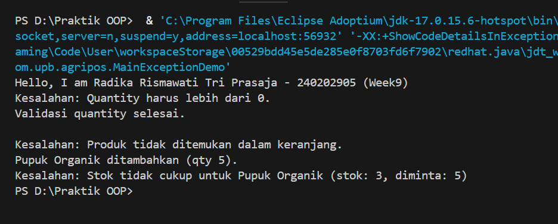

# Laporan Praktikum Minggu 9
Topik: Exception Handling, Custom Exception, dan Penerapan Design Pattern

## Identitas
- Nama  : Radika Rismawati Tri Prasaja
- NIM   : 240202905
- Kelas : 3IKRB

---

## Tujuan
1. Menjelaskan perbedaan antara error dan exception.
2. Mengimplementasikan try–catch–finally dengan tepat.
3. Membuat custom exception sesuai kebutuhan program.
4. Mengintegrasikan exception handling ke dalam aplikasi sederhana (kasus keranjang belanja).
5. (Opsional) Menerapkan design pattern sederhana (Singleton/MVC) dan unit testing dasar.

---

## Dasar Teori
1. Error vs Exception
Error → kondisi fatal, tidak dapat ditangani (contoh: OutOfMemoryError).
Exception → kondisi tidak normal yang dapat ditangani oleh program.

2. Struktur try–catch–finally
```
try {
    // kode yang berpotensi menimbulkan kesalahan
} catch (Exception e) {
    // penanganan
} finally {
    // blok yang selalu dijalankan
}
```
3. Membuat Custom Exception
```
package com.upb.agripos;

public class InvalidQuantityException extends Exception {
    public InvalidQuantityException(String message) {
        super(message);
    }
}
```

---

Studi Kasus Agri-POS: Keranjang Belanja
Keranjang belanja harus memvalidasi:

Jumlah pembelian > 0
Produk ada dalam keranjang
Stok mencukupi
Kesalahan–kesalahan tersebut ditangani menggunakan custom exception.

---

## Langkah Praktikum
1. Membuat Custom Exception
```
package com.upb.agripos;

public class InvalidQuantityException extends Exception {
    public InvalidQuantityException(String msg) { super(msg); }
}
package com.upb.agripos;

public class ProductNotFoundException extends Exception {
    public ProductNotFoundException(String msg) { super(msg); }
}
package com.upb.agripos;

public class InsufficientStockException extends Exception {
    public InsufficientStockException(String msg) { super(msg); }
}
```

2. Model Product dengan Stok
```
package com.upb.agripos;

public class Product {
    private final String code;
    private final String name;
    private final double price;
    private int stock;

    public Product(String code, String name, double price, int stock) {
        this.code = code;
        this.name = name;
        this.price = price;
        this.stock = stock;
    }

    public String getCode() { return code; }
    public String getName() { return name; }
    public double getPrice() { return price; }
    public int getStock() { return stock; }
    public void reduceStock(int qty) { this.stock -= qty; }
}
```

3. Implementasi ShoppingCart dengan Exception Handling
```
package com.upb.agripos;

import java.util.HashMap;
import java.util.Map;

public class ShoppingCart {
    private final Map<Product, Integer> items = new HashMap<>();

    public void addProduct(Product p, int qty) throws InvalidQuantityException {
        if (qty <= 0) {
            throw new InvalidQuantityException("Quantity harus lebih dari 0.");
        }
        items.put(p, items.getOrDefault(p, 0) + qty);
    }

    public void removeProduct(Product p) throws ProductNotFoundException {
        if (!items.containsKey(p)) {
            throw new ProductNotFoundException("Produk tidak ada dalam keranjang.");
        }
        items.remove(p);
    }

    public void checkout() throws InsufficientStockException {
        for (Map.Entry<Product, Integer> entry : items.entrySet()) {
            Product product = entry.getKey();
            int qty = entry.getValue();
            if (product.getStock() < qty) {
                throw new InsufficientStockException(
                    "Stok tidak cukup untuk: " + product.getName()
                );
            }
        }
        // contoh pengurangan stok bila semua cukup
        for (Map.Entry<Product, Integer> entry : items.entrySet()) {
            entry.getKey().reduceStock(entry.getValue());
        }
    }
}
```

4. Main Program untuk Menguji Exception Handling
```
package com.upb.agripos;

public class MainExceptionDemo {
    public static void main(String[] args) {
        System.out.println("Hello, I am [Nama]-[NIM] (Week9)");

        ShoppingCart cart = new ShoppingCart();
        Product p1 = new Product("P01", "Pupuk Organik", 25000, 3);

        try {
            cart.addProduct(p1, -1);
        } catch (InvalidQuantityException e) {
            System.out.println("Kesalahan: " + e.getMessage());
        }

        try {
            cart.removeProduct(p1);
        } catch (ProductNotFoundException e) {
            System.out.println("Kesalahan: " + e.getMessage());
        }

        try {
            cart.addProduct(p1, 5);
            cart.checkout();
        } catch (Exception e) {
            System.out.println("Kesalahan: " + e.getMessage());
        }
    }
}
```

---

Design Pattern Sederhana
1. Singleton Pattern
Digunakan untuk layanan yang hanya boleh ada satu instance, misalnya ProductService.
```
package com.upb.agripos;

public class ProductService {
    private static ProductService instance;
    private ProductService() {}

    public static ProductService getInstance() {
        if (instance == null) { instance = new ProductService(); }
        return instance;
    }
}
```

2. Konsep MVC
Model → Product, ShoppingCart
View → tampilkan output terminal
Controller → MainExceptionDemo

---

## Kode Program
1. InsufficientStockException.java
```
package main.java.com.upb.agripos;

public class InsufficientStockException extends Exception {
    public InsufficientStockException(String msg) { super(msg); }
}
```
2. InvalidQuantityException.java
```
package main.java.com.upb.agripos;

public class InvalidQuantityException extends Exception {
    public InvalidQuantityException(String message) {
        super(message);
    }
}
```

3. MainExceptionDemo.java
```
package main.java.com.upb.agripos;

public class MainExceptionDemo {

    public static void main(String[] args) {

        System.out.println("Hello, I am Radika Rismawati Tri Prasaja - 240202905 (Week9)");

        ShoppingCart cart = new ShoppingCart();
        Product pupuk = new Product("P01", "Pupuk Organik", 25000, 3);

        // 1. Invalid quantity
        try {
            cart.addProduct(pupuk, -1);
        } catch (InvalidQuantityException e) {
            System.out.println("Kesalahan: " + e.getMessage());
        } finally {
            System.out.println("Validasi quantity selesai.\n");
        }

        // 2. Remove product not in cart
        try {
            cart.removeProduct(pupuk);
        } catch (ProductNotFoundException e) {
            System.out.println("Kesalahan: " + e.getMessage());
        }

        // 3. Insufficient stock
        try {
            cart.addProduct(pupuk, 5);
            cart.checkout();
        } catch (Exception e) {
            System.out.println("Kesalahan: " + e.getMessage());
        }
    }
}
```

4. Product.java
```
package main.java.com.upb.agripos;

public class Product {

    private final String code;
    private final String name;
    private final double price;
    private int stock;

    public Product(String code, String name, double price, int stock) {
        this.code = code;
        this.name = name;
        this.price = price;
        this.stock = stock;
    }

    public String getCode() { return code; }
    public String getName() { return name; }
    public double getPrice() { return price; }
    public int getStock() { return stock; }

    public void reduceStock(int qty) {
        this.stock -= qty;
    }

    // penting untuk Map
    @Override
    public boolean equals(Object o) {
        if (this == o) return true;
        if (!(o instanceof Product)) return false;
        Product p = (Product) o;
        return code.equals(p.code);
    }

    @Override
    public int hashCode() {
        return code.hashCode();
    }
}
```

5. ProductNotFoundException.java
```
package main.java.com.upb.agripos;

public class ProductNotFoundException extends Exception {
    public ProductNotFoundException(String message) {
        super(message);
    }
}
```
6. ShoppingCart.java
```
package main.java.com.upb.agripos;

import java.util.HashMap;
import java.util.Map;

public class ShoppingCart {

    private final Map<Product, Integer> items = new HashMap<>();

    // tambahProduk
    public void addProduct(Product product, int qty)
            throws InvalidQuantityException {

        if (qty <= 0) {
            throw new InvalidQuantityException("Quantity harus lebih dari 0.");
        }

        items.put(product, items.getOrDefault(product, 0) + qty);
        System.out.println(product.getName() + " ditambahkan (qty " + qty + ").");
    }

    // hapusProduk
    public void removeProduct(Product product)
            throws ProductNotFoundException {

        if (!items.containsKey(product)) {
            throw new ProductNotFoundException(
                "Produk tidak ditemukan dalam keranjang."
            );
        }

        items.remove(product);
        System.out.println(product.getName() + " dihapus dari keranjang.");
    }

    // checkout
    public void checkout() throws InsufficientStockException {

        for (Map.Entry<Product, Integer> entry : items.entrySet()) {
            Product p = entry.getKey();
            int qty = entry.getValue();

            if (p.getStock() < qty) {
                throw new InsufficientStockException(
                    "Stok tidak cukup untuk " + p.getName() +
                    " (stok: " + p.getStock() + ", diminta: " + qty + ")"
                );
            }
        }

        // pengurangan stok
        for (Map.Entry<Product, Integer> entry : items.entrySet()) {
            entry.getKey().reduceStock(entry.getValue());
        }

        System.out.println("Checkout berhasil. Stok diperbarui.");
    }
}
```

---

## Hasil Eksekusi


---

## Analisis
1. Jelaskan bagaimana kode berjalan!
Jawab: Program diawali dengan eksekusi kelas MainExceptionDemo yang berperan sebagai controller dan mengatur alur aplikasi. Objek ShoppingCart dibuat sebagai wadah penyimpanan produk, sedangkan objek Product merepresentasikan data barang lengkap dengan informasi stok.

Alur eksekusi program berjalan sebagai berikut:

    1. Program mencoba menambahkan produk ke dalam keranjang dengan jumlah negatif.
    Kondisi ini divalidasi pada method addProduct(), sehingga sistem melempar InvalidQuantityException dan ditangani menggunakan blok try–catch.

    2. Program kemudian mencoba menghapus produk yang belum ada di dalam keranjang.
    Karena produk tidak ditemukan, method removeProduct() melempar ProductNotFoundException dan ditangani oleh catch.

    3. Pada tahap berikutnya, program menambahkan produk dengan jumlah yang melebihi stok yang tersedia.
    Saat proses checkout(), sistem memeriksa kecukupan stok dan melempar InsufficientStockException jika stok tidak mencukupi.

    4. Jika seluruh proses validasi lolos, sistem akan mengurangi stok produk sesuai jumlah pembelian dan menampilkan pesan bahwa proses checkout berhasil.

Dengan alur ini, setiap kesalahan dapat ditangani secara terkontrol tanpa menghentikan program secara tiba-tiba.

2. Apa perbedaan pendekatan minggu ini dibanding minggu sebelumnya? 
Jawab: Perbedaan utama antara Week 9 dan Week 7 terletak pada mekanisme penanganan kesalahan dan desain program.

Pada Week 7, fokus utama adalah penggunaan collection (List dan Map) untuk menyimpan data produk serta menghitung total belanja. Namun, kesalahan input seperti jumlah negatif atau stok tidak mencukupi belum ditangani secara eksplisit sehingga berpotensi menimbulkan bug.

Sedangkan pada Week 9, sistem dikembangkan lebih lanjut dengan:

    1. Penerapan exception handling menggunakan try–catch–finally

    2. Pembuatan custom exception (InvalidQuantityException, ProductNotFoundException, dan InsufficientStockException)

    3. Validasi logika bisnis yang lebih ketat dan aman

    4. Penerapan design pattern sederhana (Singleton dan konsep MVC)

Dengan pendekatan ini, sistem menjadi lebih robust, mudah dipelihara, dan siap dikembangkan ke skala yang lebih besar.

3. Kendala yang dihadapi dan cara mengatasinya
Jawab: Kendala utama yang dihadapi dalam praktikum ini antara lain:

    1. Menentukan jenis exception yang tepat untuk setiap kondisi kesalahan

    2. Mengatur alur try–catch agar program tetap berjalan meskipun terjadi kesalahan

    3. Menghindari duplikasi produk dalam struktur data Map

Cara mengatasinya adalah dengan:

    1. Memisahkan setiap jenis kesalahan ke dalam custom exception yang spesifik

    2. Menggunakan blok try–catch terpisah untuk setiap skenario pengujian

    3. Mengimplementasikan method equals() dan hashCode() pada class Product

    4. Menguji program secara bertahap untuk memastikan setiap exception bekerja sesuai harapan

Pendekatan ini membuat proses debugging lebih mudah dan struktur kode menjadi lebih rapi serta terorganisir.

---

## Kesimpulan
Pada praktikum Minggu ke-9, telah berhasil diimplementasikan konsep exception handling, custom exception, serta penerapan design pattern sederhana pada sistem Agri-POS. Program tidak hanya berfokus pada fungsionalitas, tetapi juga pada ketahanan sistem terhadap kesalahan (error handling).

Melalui penggunaan mekanisme try–catch–finally, setiap kondisi kesalahan seperti jumlah pembelian tidak valid, produk tidak ditemukan dalam keranjang, dan stok yang tidak mencukupi dapat ditangani secara terkontrol tanpa menghentikan eksekusi program. Penerapan custom exception memungkinkan pemisahan jenis kesalahan secara jelas sehingga logika program menjadi lebih terstruktur dan mudah dipahami.

Selain itu, penerapan Singleton Pattern dan konsep MVC membantu meningkatkan kualitas desain perangkat lunak dengan membatasi pembuatan objek yang tidak perlu serta memisahkan tanggung jawab antar komponen sistem. Hal ini membuat kode lebih mudah dirawat, diuji, dan dikembangkan di masa mendatang.

Dengan demikian, praktikum Minggu ke-9 memberikan pemahaman yang lebih mendalam mengenai pentingnya penanganan kesalahan dan desain yang baik dalam pengembangan aplikasi berbasis Object-Oriented Programming, khususnya pada studi kasus sistem Agri-POS.

---

## Quiz
1. Jelaskan perbedaan error dan exception!
   **Jawaban:** **Error** adalah kondisi kesalahan serius yang umumnya tidak dapat ditangani oleh program dan biasanya disebabkan oleh masalah sistem atau lingkungan runtime, seperti OutOfMemoryError atau StackOverflowError. Error bersifat fatal dan dapat menyebabkan program berhenti secara tiba-tiba.

    **Exception** adalah kondisi tidak normal yang masih dapat diprediksi dan ditangani oleh program menggunakan mekanisme exception handling. Contohnya adalah kesalahan input, data tidak ditemukan, atau stok tidak mencukupi. Exception memungkinkan program tetap berjalan meskipun terjadi kesalahan.

2. Apa fungsi finally dalam blok try–catch–finally?
   **Jawaban:** Blok finally berfungsi untuk menjalankan kode yang pasti dieksekusi, baik terjadi exception maupun tidak. Biasanya digunakan untuk proses pembersihan (cleanup), seperti menampilkan pesan akhir, menutup resource, atau memastikan suatu proses validasi telah selesai dilakukan.

    Dalam sistem Agri-POS, finally dapat digunakan untuk menampilkan informasi bahwa proses validasi transaksi telah dilakukan, meskipun transaksi gagal karena exception.

3. Mengapa custom exception diperlukan?
   **Jawaban:** Custom exception diperlukan untuk:

    1. Memisahkan jenis kesalahan secara spesifik sesuai kebutuhan bisnis

    2. Membuat kode lebih mudah dipahami dan dirawat

    3. Memberikan pesan kesalahan yang lebih informatif kepada pengguna

    4. Menghindari penggunaan exception umum yang terlalu abstrak

Dengan custom exception, logika bisnis pada sistem POS menjadi lebih jelas dan terstruktur, misalnya membedakan kesalahan stok, kesalahan jumlah, dan kesalahan data produk.

4. Berikan contoh kasus bisnis dalam POS yang membutuhkan custom exception!
    **Jawaban:** Contoh kasus bisnis dalam sistem Agri-POS yang membutuhkan custom exception antara lain:

    1. InvalidQuantityException → ketika kasir memasukkan jumlah pembelian kurang dari atau sama dengan nol

    2. ProductNotFoundException → ketika produk yang ingin dihapus tidak ada di dalam keranjang

    3. InsufficientStockException → ketika jumlah pembelian melebihi stok yang tersedia

Penggunaan custom exception pada kasus tersebut membantu sistem memberikan respon yang tepat tanpa menghentikan aplikasi secara keseluruhan.
